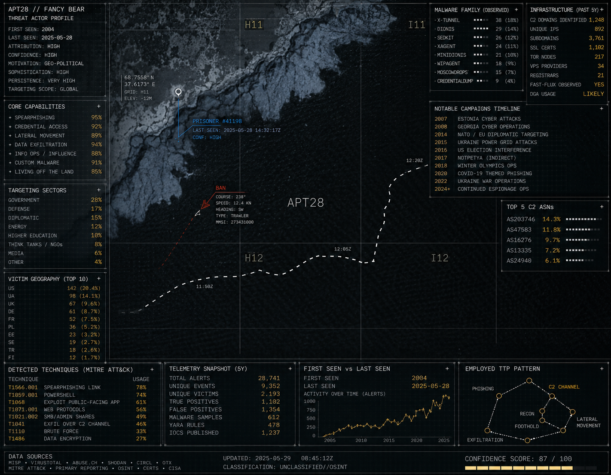
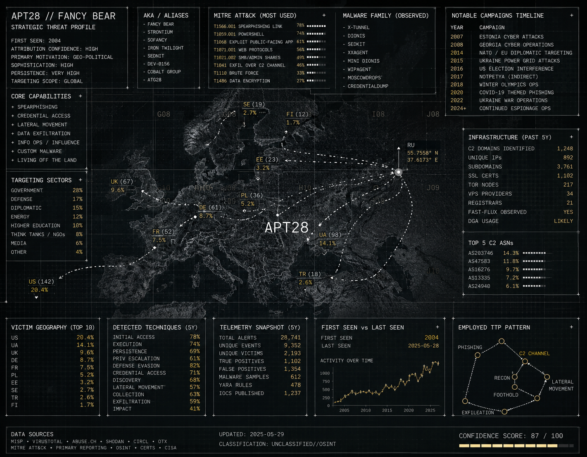

+++
title = "APT28 - Biggest Potential Cyber Threat to Brazil's 2026 Elections"
date = '2026-07-23T01:08:09-03:00'
draft = false
tags = ["cybersecurity", "APTs", "technopolitcs"]
categories = ["Cyber Threat Intelligence Research"]
+++



# Why APT28 (Fancy Bear) Is a Credible Threat to Brazil's 2026 Presidential Election
## 1. Cyber Threat Intelligence Profile & Risk Assessment



**Date:** 30 July 2026
**Prepared by:** Independent Cyber Threat Intelligence Research
**Subject actor:** APT28 / Fancy Bear (MITRE ATT&CK Group **G0007**)
**Scope:** Brazilian general elections, first round 4 October 2026 / runoff 25 October 2026

*Methodology note: this profile is built entirely from open-source intelligence, MITRE ATT&CK, government cybersecurity advisories (CISA, NSA, NCSC-UK, and co-sealing partner agencies), vendor threat research (Mandiant, ESET, Volexity, Sekoia, Cyble, CYFIRMA), court filings, and Brazil-specific institutional and political-risk reporting. No classified or proprietary intelligence was used. All indicators should be validated against live feeds before operational use, several are dated and may no longer be actor-controlled.*

---

## 2. Executive Summary

APT28, publicly known as **Fancy Bear**, **Sofacy**, **Sednit**, **Forest Blizzard**, **STRONTIUM**, **Pawn Storm**, and by a dozen other names, is a Russian military cyber-espionage unit operating under the GRU (Russia's foreign military intelligence directorate) since at least the mid-2000s.<cite index="33-1">It is tracked by MITRE ATT&CK as Group G0007</cite>, and it is one of only a handful of threat actors with a *proven, repeated, documented* track record of interfering in national elections: the 2016 US presidential race, the 2017 French presidential race, and the 2015–2017 German Bundestag and party breaches all carry government or multi-source attribution to this group.

That history matters for Brazil. Brazil holds a first-round presidential vote on **4 October 2026** (runoff 25 October, if required) [28]. Brazil's electronic voting machines are a comparatively hard target, they are offline, cryptographically sealed, and independently audited [28], but APT28's proven playbook has never really been about hacking voting machines. It is about compromising campaigns, parties, ministries, and election-adjacent contractors, stealing correspondence, and timing a leak (genuine material mixed with fabrications) for maximum disruption, exactly what happened to the Clinton campaign in 2016 and the Macron campaign in 2017.

Three things elevate Brazil's exposure beyond a generic "any country could be a target" statement:

1. **APT28 already appears in vendor target-country lists that include Brazil**, and independent 2025–2026 reporting from ESET and Sekoia explicitly notes South America among the regions touched by current campaigns, albeit as a secondary theater far smaller than Ukraine/NATO [12][14][15][16].
2. **Brazil is already a documented target of the broader Russian state influence apparatus.** The U.S. State Department's Global Engagement Center named Brazil among the countries targeted by a Kremlin-funded "influence-for-hire" disinformation network, and Brazil's own intelligence service (ABIN) flagged external interference and cyberattacks as a 2026 election risk in its own threat outlook [24][27].
3. **The demonstrated hack-and-leak pattern doesn't require Brazil to be a top-tier priority target**, it only requires one successful compromise of a campaign, ministry, or election-adjacent contractor, timed for release, to be amplified through an ecosystem that already exists.

Overall assessed risk to Brazil's 2026 elections from APT28 specifically is **MODERATE, with meaningful upside uncertainty**, not confirmed active targeting, but a documented capability, a documented playbook, a documented (if secondary) regional footprint, and a documented complementary disinformation ecosystem already active in the country. Sections 6 and 8 explain exactly how that confidence level was derived and where the evidence runs out.

---

## 3. Threat Actor Overview

### 3.1 Background and History

Sources disagree slightly on APT28's founding date, Malpedia dates it to "likely operating since 2007" [3], while other trackers place activity from 2004 [4][40], but there is no disagreement that it is one of the longest continuously active nation-state APTs in public reporting. It was first named and detailed publicly by Mandiant in October 2014, in a report that assessed the group was "most likely sponsored by the Russian government" based on malware development patterns consistent with Russian-language, Moscow/St. Petersburg business-hours developers [2]. <cite index="33-1">MITRE ATT&CK's own summary notes the group compromised the Hillary Clinton campaign, the DNC, and the DCCC in 2016 in an attempt to interfere with the U.S. presidential election</cite>, and separately notes a 2018 U.S. indictment of five GRU Unit 26165 officers for operations against WADA, USADA, a U.S. nuclear facility, the OPCW, and the Spiez Swiss chemicals laboratory, conducted between 2014 and 2018 [33].

The group has survived public exposure, criminal indictments, an EU sanctions regime, and the diplomatic expulsion of its own officers, and remains highly active as of mid-2026: CISA, NSA, and nineteen partner agencies co-sealed a fresh advisory on the group's activity in 2025 (corrected as recently as April 2026) [9], ESET published new technical findings in 2025 [12], and Sekoia and The Hacker News both published fresh tradecraft and malware reporting in the first half of 2026 [13][14].

### 3.2 Known Aliases and Affiliations

Few threat actors have accumulated as many industry names, a direct consequence of two decades of independent tracking by different vendors and governments before everyone converged on the fact that they were watching the same group. <cite index="33-1">MITRE ATT&CK lists associated names including IRON TWILIGHT, SNAKEMACKEREL, Swallowtail, Group 74, Sednit, Sofacy, Pawn Storm, Fancy Bear, STRONTIUM, Tsar Team, Threat Group-4127 (TG-4127), Forest Blizzard, FROZENLAKE, and GruesomeLarch</cite>.

| Vendor / Government | Name used |
|---|---|
| CrowdStrike | Fancy Bear |
| Kaspersky | Sofacy / Sofacy Group |
| ESET | Sednit |
| Microsoft | STRONTIUM → **Forest Blizzard** (current) |
| Trend Micro | Pawn Storm |
| Secureworks | IRON TWILIGHT |
| Volexity | GruesomeLarch |
| Palo Alto Unit 42 | Fighting Ursa |
| IBM X-Force | ITG05 |
| Proofpoint | TA422 |
| Recorded Future / NCSC-UK | BlueDelta |
| CERT-UA (Ukraine) | UAC-0001 / UAC-0028 / UAC-0063 |
| U.S. government (joint advisories) | APT28 |

Institutionally, APT28 is attributed to **Russia's GRU (General Staff Main Intelligence Directorate), 85th Main Special Service Center (GTsSS), military unit 26165** [9][33]. It is operationally distinct from, but occasionally works alongside, **GRU Unit 74455 ("Sandworm")**, which <cite index="33-1">assisted with some of the 2014–2018 operations against WADA and related anti-doping targets</cite>, and from **APT29 ("Cozy Bear")**, a separate Russian group linked to the SVR foreign intelligence service that was independently present in the 2016 DNC compromise. Section 6.3 discusses these boundaries in more depth.

### 3.3 Motivation and Objectives

Mandiant's original 2014 assessment remains broadly accurate: unlike Chinese state-linked actors tracked at the time, "APT28 does not appear to conduct widespread intellectual property theft for economic gain… [it] focuses on collecting intelligence that would be most useful to a government… related to governments, militaries and security organizations that would likely benefit the Russian government" [2]. Over a decade of subsequent activity has layered on a second, closely related objective: **shaping political outcomes abroad** through theft-and-leak operations timed around elections, referenda, and geopolitically sensitive moments (DNC/Podesta 2016, Macron campaign 2017, Bundestag 2015). A third objective, dominant since Russia's 2022 full-scale invasion of Ukraine, is **operational military intelligence in direct support of the war**, tracking Western logistics and aid deliveries into Ukraine, including through compromised IP cameras at border crossings and rail stations [9].

### 3.4 Estimated Capabilities and Resources

APT28 should be assessed as a **top-tier, state-resourced actor**, it has operated continuously for roughly two decades against hardened government, military, and NATO targets despite sustained public exposure, criminal prosecution, and sanctions, which itself is a strong indicator of deep institutional backing rather than a small or transient team. Concrete evidence of its technical depth includes:

- **Zero-day development and rapid weaponization.** APT28 has used at least one Windows Print Spooler zero-day (CVE-2022-38028, exploited via the GooseEgg post-exploitation tool) [131], an Outlook zero-day/logic flaw (CVE-2023-23397) that leaked NTLM credentials via calendar invitations before it was patched [9], and, per April 2026 reporting, began preparing infrastructure for two newly disclosed CVEs (CVE-2026-21509 and CVE-2026-21513) roughly two weeks *before* one of them was publicly disclosed [89].
- **Firmware and kernel-level persistence.** ESET's 2018 discovery of **LoJax** made APT28 the first publicly documented actor to deploy a UEFI rootkit in the wild, malware that survives a full OS reinstall by living in motherboard firmware [39]. Separately, the NSA/FBI's 2020 **Drovorub** advisory detailed a four-component Linux toolkit (implant, C2 server, file-transfer tool, and a kernel-module rootkit) built specifically to evade detection on Linux systems, including Department of Defense infrastructure [8].
- **Genuine tradecraft innovation.** In late 2024, Volexity disclosed what it called the **"Nearest Neighbor Attack"**, the first publicly documented case of an attacker breaching an organization's enterprise Wi-Fi network from thousands of miles away by daisy-chaining through the networks of physically nearby, separately-compromised organizations until a dual-homed (wired + wireless) device was found that could bridge onto the target's Wi-Fi [10][142]. This is a materially important data point for any country, including Brazil, that assumes geographic distance from Russia or Ukraine provides some protective effect, it demonstrably does not.
- **Global, adaptive infrastructure.** The actor routinely abuses compromised small office/home office (SOHO) routers and internet-exposed IP cameras as relay nodes, layers Tor and commercial VPNs, and hosts phishing redirectors on free or "API-mocking" services that are cheap to stand up and abandon [9].

---

## 4. Targeting and Victimology

### 4.1 Geographic Regions Targeted

APT28's overwhelming operational focus for the past four years has been **Ukraine and NATO/EU member states** directly supporting it. <cite index="94-1">A 2025 joint advisory co-sealed by the US, UK, Germany, Czech Republic, Poland, Australia, Canada, Denmark, Estonia, France, and the Netherlands describes over two years of sustained targeting of logistics and technology entities involved in coordinating Western aid to Ukraine</cite>, with confirmed targeted entities in Bulgaria, Czech Republic, France, Germany, Greece, Italy, Moldova, Netherlands, Poland, Romania, Slovakia, Ukraine, and the United States [96].

Outside that primary theater, multiple independent sources place **Brazil and South America** in APT28's broader historical footprint:

- Commercial threat-intelligence vendors Cyble and CYFIRMA both list **Brazil explicitly** among APT28's historically targeted countries in their respective actor profiles, alongside dozens of others spanning Europe, Asia, Africa, and the Americas [15][16].
- ESET's May 2025 "Operation RoundPress" report, a webmail zero-day campaign attributed to APT28 with **medium confidence**, states that "most victims are governmental entities and defense companies in Eastern Europe, although we have observed governments in Africa, Europe, and **South America** being targeted as well" [12][127].
- French threat-intel firm Sekoia's 2026 tradecraft review similarly notes "a smaller number of government, military and academic targets in Africa, the EU and **South America**" [14][132].
- A 2018 Security Affairs headline, "APT28 group return to intelligence ops in Europe and South America", indicates this is not a new phenomenon; the region has recurred in this actor's footprint for years [17].

**Honest caveat:** this South America/Brazil presence is consistently described as *secondary and smaller-scale* relative to the Ukraine/NATO theater, and appears in aggregated vendor target-country lists rather than in a dedicated, named incident report the way the Bundestag, DNC, or Macron-campaign compromises are. No public reporting reviewed for this profile describes a specific, named APT28 intrusion into a Brazilian government, party, or electoral institution. That absence of evidence is itself an important data point and is treated as such throughout the risk assessment in Section 8.

### 4.2 Industries and Sectors Targeted

Government ministries and militaries; political parties, campaigns, and individual politicians; national election-administration bodies; defense contractors; the logistics, transportation, maritime, and air-traffic-management sectors (2022–2025 Ukraine-aid campaign) [96]; IT services and managed webmail providers; media and think tanks; and international bodies (NATO, OSCE, OPCW) and sports/anti-doping organizations (WADA, IOC) following Russia's state-doping sanctions [33][19].

### 4.3 Types of Organizations Targeted

Within those sectors, APT28 gravitates toward organizations that hold **high-value correspondence or operational data**: national election commissions and electoral courts, campaign headquarters and individual staffers' personal accounts, foreign and defense ministries, and, per the 2025 logistics advisory, companies with no obvious political profile at all, but which happen to sit inside the supply chain of something Russia cares about (rail operators, shipping firms, IT vendors serving those firms) [96].

### 4.4 Selection Criteria and Patterns

Four consistent selection patterns emerge across a decade of public reporting:

1. **Alignment with current Russian geopolitical priorities**, overwhelmingly the Ukraine war since 2022, historically anti-doping retaliation (WADA/OPCW) and NATO-adjacent political targets.
2. **High-value communications ahead of politically significant dates**, the DNC and Macron-campaign operations were both timed around election calendars, not random.
3. **Trusted-relationship pivoting**, <cite index="96-1">the 2025 advisory documents APT28 conducting "follow-on targeting of additional entities in the transportation sector that had business ties to the primary target, exploiting trust relationships to attempt to gain additional access"</cite>, meaning a company doesn't need to be the primary target to be drawn in, it just needs a business relationship with one.
4. **Opportunistic, indiscriminate scanning of exposed infrastructure**, unpatched webmail, exposed IP cameras, and default-credentialed routers get swept up globally regardless of the host country's strategic priority, which is the most plausible explanation for why lower-priority countries like Brazil appear at all in vendor target lists without a dedicated campaign being publicly documented.

---

## 5. Tactics, Techniques, and Procedures (TTPs)

### 5.1 Attack Vectors and Initial Access Methods

- **Spearphishing (link and attachment).** <cite index="96-1">Emails contain links to fake login pages impersonating government entities and Western cloud email providers, typically hosted on free third-party services or compromised SOHO devices, written in the target's native language and sent to a single recipient</cite>. Some campaigns add multi-stage redirectors that check the visitor's IP geolocation and browser fingerprint before serving the real phishing page, anyone failing the check (e.g., a security researcher) is quietly redirected to a benign site like msn.com [96].
- **Credential brute-forcing at scale.** A 2019–2021 campaign used a Kubernetes cluster to conduct "widespread, distributed, and anonymized brute force access attempts against hundreds of government and private-sector targets worldwide," routed through Tor and commercial VPNs to frustrate detection [63][65]. A near-identical technique, now using LDAP-based password spraying, was still active as of the 2025 advisory [96].
- **Exploitation of known, patchable CVEs.** Outlook's CVE-2023-23397 (NTLM hash leak via calendar invite) [96]; three Roundcube webmail CVEs (CVE-2020-12641, CVE-2020-35730, CVE-2021-44026) used to run arbitrary shell commands and pull mail data [96]; a WinRAR flaw (CVE-2023-38831) allowing code execution from a crafted archive [96]; the 2017 Cisco IOS SNMP flaw CVE-2017-6742, still being exploited against unpatched routers as of 2023 [51][60]; and, in 2026, rapid weaponization of two newly disclosed CVEs before public disclosure [89].
- **Voice phishing (vishing)** impersonating IT staff to obtain privileged account access [96].
- **The Nearest Neighbor Wi-Fi attack** described in Section 3.4, a genuinely novel technique for defeating both MFA and geographic distance simultaneously [10].
- **Exploitation of internet-exposed IP cameras** via RTSP DESCRIBE requests using default or brute-forced credentials, used to physically monitor aid shipments and border crossings, of a documented sample of over 10,000 targeted cameras, 81% were in Ukraine and most of the remainder in bordering NATO states [96].

### 5.2 Malware and Tools Used

| Tool / Malware | Type | Function | Source |
|---|---|---|---|
| X-Agent / CHOPSTICK | Modular implant | Keylogging, screen capture, exfiltration; historically ported across Windows/Linux/mobile | [39][50] |
| X-Tunnel | Network tool | Encrypted tunneling/proxy for C2 | [50] |
| Seduploader / Sedreco | Downloader | First-stage loader; fingerprints sandboxes to avoid analysis; XOR string obfuscation | [43] |
| Zebrocy | Downloader/backdoor | Delphi/Go/C# variants, broad indiscriminate targeting | [39] |
| LoJax | UEFI rootkit | First in-the-wild UEFI rootkit publicly documented; motherboard-firmware persistence | [39] |
| Drovorub | Linux rootkit suite | Kernel-module rootkit + implant + C2 server + port-forwarding tool | [8] |
| GooseEgg | Post-exploitation tool | Exploits Print Spooler CVE-2022-38028 for privilege escalation | [131] |
| HEADLACE | Backdoor | Delivered via malicious shortcuts and batch/PowerShell scripts | [9] |
| MASEPIE | Python backdoor | File transfer and remote command execution over an encrypted channel | [9] |
| OCEANMAP / STEELHOOK | Credential stealers | Harvest stored Chrome/Edge credentials and browser data | [9] |
| Impacket, PsExec, Certipy, ADExplorer | Open-source / legit admin tools (abused) | Lateral movement, Active Directory Certificate Services abuse, AD enumeration | [9] |
| Get-GPPPassword.py, ldap-dump.py | Open-source scripts | Recovering plaintext Group Policy Preferences passwords; LDAP enumeration | [9] |
| CompuTrace/Computrace abuse | BIOS anti-theft feature | Abused as a persistence mechanism | [50] |

### 5.3 Infrastructure Characteristics

APT28's infrastructure model favors **cheap, disposable, and hard-to-attribute** hosting over dedicated bulletproof servers. <cite index="96-1">The actors abuse vulnerabilities in a range of SOHO devices to proxy malicious activity via devices geolocated close to the intended target</cite>, defeating naive geo-IP filtering. Redirector infrastructure is routinely hosted on free dynamic-DNS and "API-mocking"/webhook services, which are trivial to stand up and abandon. As of the 2025 advisory, defenders were advised to alert on traffic to the following provider patterns (abbreviated list; full list in Section 7.1):

`*.mocky[.]io` · `*.webhook[.]site` · `*.pipedream[.]net` · `*.ngrok[.]io` · `*.ddnsgeek[.]com` · `*.frge[.]io` · `*.infinityfreeapp[.]com` · `*.mockbin[.]org`

Command-and-control traffic is layered behind Tor and commercial VPNs with frequent IP rotation, and all observed brute-force connections in the 2025 advisory used encrypted TLS [96].

### 5.4 Operational Security Measures

APT28 shows consistent OPSEC discipline: sandbox-evasion checks in first-stage downloaders [43]; DLL search-order hijacking to blend malicious execution with legitimate processes [96]; clearing of Windows event logs via `wevtutil` [96]; and a strong preference for **living-off-the-land**, using native, dual-use Windows utilities (`ntdsutil`, `whoami`, `tasklist`, `systeminfo`, `arp`, `net`, `wmic`, `reg`, `icacls`) instead of custom malware wherever possible, precisely because these tools' legitimate uses make anomalous activity harder to distinguish from routine administration [96]. The IP-geolocation and browser-fingerprint gating on phishing redirectors (Section 5.1) exists specifically to keep researchers and automated scanners from ever seeing the real payload [96].

### 5.5 MITRE ATT&CK Mapping

The following mapping draws primarily on the MITRE ATT&CK-tagged activity documented in the 2025 joint advisory [9], supplemented by additional techniques documented elsewhere in this profile.

| Tactic | Technique | ID | Observed Use |
|---|---|---|---|
| Reconnaissance | Gather Victim Org Information | T1591 | Reconnaissance of target cybersecurity departments and business partners |
| Resource Development | Compromise Accounts (Email/Cloud) | T1586.002/.003 | Sending phishing from compromised legitimate accounts |
| Initial Access | Phishing | T1566 | Credential-harvesting links and malware-laden attachments |
| Initial Access | Trusted Relationship | T1199 | Pivoting through partners with business ties to the primary target |
| Initial Access | Exploit Public-Facing Application | T1190 | Outlook, Roundcube, Cisco IOS, WinRAR CVEs |
| Initial Access | External Remote Services | T1133 | Corporate VPN exploitation |
| Execution | Command and Scripting Interpreter | T1059 (.001/.003/.005/.006) | PowerShell, BAT, VBScript, Python payloads |
| Persistence | Boot/Logon Autostart (Registry Run Keys) | T1547.001 | Persistence via run keys |
| Persistence | Pre-OS Boot: System Firmware | T1542.001 | LoJax UEFI rootkit |
| Persistence | Account Manipulation (mailbox permissions) | T1098.002 | Sustained email collection via mailbox-permission abuse |
| Privilege Escalation / Defense Evasion | DLL Search Order Hijacking | T1574.001 | Malware execution disguised as legitimate loads |
| Defense Evasion | Indicator Removal (Clear Event Logs) | T1070.001 | `wevtutil` log clearing |
| Credential Access | Brute Force (Password Spraying) | T1110.003 | Kubernetes- and LDAP-based spraying |
| Credential Access | Forced Authentication | T1187 | Outlook CVE-2023-23397 NTLM leak |
| Credential Access | OS Credential Dumping (NTDS) | T1003.003 | Active Directory database export |
| Credential Access | Unsecured Credentials (GPP) | T1552.006 | Plaintext passwords from Group Policy Preferences |
| Discovery | Account Discovery (Domain Account) | T1087.002 | LDAP enumeration scripts |
| Collection | Screen Capture / Clipboard Data | T1113 / T1115 | X-Agent capabilities |
| Collection | Video Capture | T1125 | IP camera feed access |
| Collection | Automated / Email Collection | T1114 / T1119 | Exchange Web Services / IMAP mail collection |
| Command and Control | Proxy (External / Multi-hop) | T1090.002/.003 | SOHO device relays; Tor/VPN layering |
| Command and Control | Multi-Stage Channels | T1104 | Geofenced phishing redirectors |
| Exfiltration | Exfiltration Over Alternative Protocol | T1048 | OpenSSH-based data exfiltration |
| Exfiltration | Scheduled Transfer | T1029 | Periodic EWS-based mail collection |

---

## 6. Attribution and Campaign Linking

### 6.1 Evidence Linking to Known Campaigns or Incidents

| Year | Incident | Attribution basis |
|---|---|---|
| 2015 | German Bundestag network breach | German BfV public attribution; independent forensic analysis of C2 infrastructure and shared SSL certificates with prior Sofacy phishing infrastructure; May 2020 German federal prosecutor arrest warrant for GRU officer Dmitry Badin [82][85][87] |
| 2016 | DNC / DCCC / Podesta (Clinton campaign) | U.S. DOJ indictment of twelve GRU intelligence officers, 13 July 2018 (Mueller investigation) [18][33] |
| 2017 | Macron campaign phishing and pre-runoff document leak | Trend Micro technically linked the phishing infrastructure to prior Sofacy/APT28 campaigns against the German CDU, Turkish/Montenegrin parliaments, WADA, Westinghouse, and the DNC; cyber-intelligence firm Flashpoint's initial assessment was explicitly preliminary ("may be behind the leak, though evidence was not yet conclusive") [22][70] |
| 2014–2018 | WADA, USADA, a U.S. nuclear facility, OPCW, Spiez Swiss chemicals laboratory | U.S. DOJ indictment of five GRU Unit 26165 officers, October 2018; separately, four GRU officers were caught and expelled by Dutch military intelligence (MIVD) during an in-person operation against the OPCW in The Hague, April 2018 [33][19] |
| 2019–2021 | Global Kubernetes-orchestrated brute-force campaign | Joint NSA/CISA/FBI/NCSC-UK advisory [63][65] |
| 2021 | Cisco router SNMP exploitation (~250 Ukrainian victims, plus European and U.S. government targets) | Joint NCSC-UK/NSA/CISA/FBI advisory, AA23-108 [6][55] |
| 2022–2024 | "Nearest Neighbor" Wi-Fi daisy-chain breach of a Washington, D.C.-area organization researching Ukraine | Volexity incident-response investigation; corroborated by overlapping indicators in a subsequent Microsoft report [10][143] |
| 2022–2025 | Sustained targeting of Western logistics/tech firms supporting Ukraine aid, plus IP-camera surveillance of border crossings | Joint advisory co-sealed by 11 countries' cyber and intelligence agencies, AA25-141A [9] |
| 2023–2025 | "Operation RoundPress", MDaemon/Roundcube webmail zero-day exploitation across Eastern Europe, with observed targets in Africa, Europe, and South America | ESET, medium-confidence attribution [12] |
| 2026 | PRISMEX malware campaign, rapid weaponization of CVE-2026-21509/21513 against Ukraine/NATO logistics targets | The Hacker News / Akamai reporting [89] |

### 6.2 Confidence Level in Attribution

Applying standard CTI confidence tiers:

- **High confidence**, institutional attribution of the APT28 cluster to GRU Unit 26165. This rests on more than a decade of *independently corroborating* evidence: a criminal indictment naming individual officers, an in-person operational compromise (the 2018 OPCW expulsion), a formal arrest warrant, EU sanctions, and consistent (if differently-named) tracking by more than a dozen government agencies and private vendors across different countries using different visibility into the same infrastructure and malware.
- **Medium-to-high confidence**, ownership of specific malware families (X-Agent, Drovorub, HEADLACE, MASEPIE) tied to the cluster via infrastructure and code overlap.
- **Medium confidence**, individual incidents attributed by a single vendor without government co-sealing. ESET's own RoundPress attribution is explicitly labeled "medium confidence" [12]; the original Macron-leak attribution was explicitly preliminary at the time it was made [22].
- **Low / not established**, **any claim that APT28 is currently running a dedicated, named campaign against Brazil's 2026 election.** No such campaign has been publicly reported as of this writing (30 July 2026). What *is* established is (a) Brazil's recurring presence in vendor-compiled historical target-country lists, (b) ESET's and Sekoia's explicit inclusion of "South America" in recent campaign victimology, and (c) a separate, well-documented Russian state disinformation apparatus (distinct from GRU Unit 26165) that has named Brazil as a target [24][25]. These are genuine, sourced data points, but they support an assessment of *elevated exposure*, not confirmation of an active campaign. Section 8 treats this distinction carefully.

### 6.3 Connections to Other Threat Groups or Nation-States

- **GRU Unit 74455 ("Sandworm")**, a separate GRU unit that has operationally assisted APT28 on at least the WADA/anti-doping-related operations [33]. Sandworm is generally the more destruction-oriented of the two (e.g., NotPetya, Ukrainian power-grid attacks) and should not be conflated with APT28's more espionage-and-influence-oriented profile.
- **APT29 ("Cozy Bear")**, a separate Russian group linked to the SVR (foreign intelligence service) rather than the GRU. Both APT28 and APT29 were independently present inside DNC networks in 2016; their co-occurrence in that incident is a frequent source of public confusion between two genuinely distinct actors.
- **The broader Russian influence-operations ecosystem**, entities such as the Social Design Agency, the Institute for Internet Development, and Structura, named by the U.S. State Department as coordinating a Kremlin-funded "influence-for-hire" disinformation campaign across Latin America including Brazil [24]. This is organizationally distinct from GRU Unit 26165, but the two have historically operated in a complementary sequence in past election-interference cases: **hack (APT28) → leak (via a persona or intermediary) → amplify (state media and influence networks)**. That is precisely the pattern seen in 2016 (DNC hack → Guccifer 2.0/DCLeaks personas → RT/Sputnik amplification) and 2017 (Macron campaign hack → Pastebin dump via "EMLEAKS" → social-media amplification). Any assessment of Brazil's risk should consider this full pipeline, not just the initial-access question.

---

## 7. Indicators of Compromise (IoCs)

**Caveat carried over directly from the source advisory, because it is honest and still true:** <cite index="96-1">"Specific IoCs may no longer be actor controlled, may themselves be compromised infrastructure or email accounts, or may be shared infrastructure such as public VPN or Tor exit nodes. Care should be taken when basing triaging logs or developing detection rules on these indicators. GRU unit 26165 almost certainly uses extensive further infrastructure and TTPs not specifically listed in this report."</cite> No Brazil-specific IOCs exist in public reporting as of this writing. All indicators below are historical, sourced to CISA Alert AA25-141A [9] unless otherwise noted, and should be cross-checked against the live STIX feeds published alongside that advisory before use in any blocklist.

### 7.1 Malicious IPs and Domains

**Dynamic-DNS / "API-mocking" services abused for phishing redirectors and C2** (alert, don't necessarily block outright, these are also used for legitimate purposes):

```
*.000[.]pe            *.ddnsguru[.]com       *.loseyourip[.]com
*.1cooldns[.]com       *.dynuddns[.]com       *.lovestoblog[.]com
*.42web[.]io           *.dynuddns[.]net       *.mockbin[.]io
*.4cloud[.]click       *.free[.]nf            *.mockbin[.]org
*.accesscan[.]org      *.freeddns[.]org       *.mocky[.]io
*.bumbleshrimp[.]com   *.frge[.]io            *.mybiolink[.]io
*.camdvr[.]org         *.glize[.]com          *.mysynology[.]net
*.casacam[.]net        *.great-site[.]net     *.mywire[.]org
*.ddnsfree[.]com       *.infinityfreeapp[.]com *.ngrok[.]io
*.ddnsgeek[.]com       *.kesug[.]com          *.ooguy[.]com

*.pipedream[.]net      *.urlbae[.]com         *.webredirect[.]org
*.rf[.]gd              *.webhook[.]site       *.wuaze[.]com
                       *.webhookapp[.]com
```

**Outlook CVE-2023-23397 exploitation infrastructure** (sender addresses and associated IPs observed in that specific campaign):

```
md-shoeb@alfathdoor[.]com[.]sa       jayam@wizzsolutions[.]com
accounts@regencyservice[.]in          m.salim@tsc-me[.]com
vikram.anand@4ginfosource[.]com       mdelafuente@ukwwfze[.]com
sarah@cosmicgold469[.]co[.]za         franch1.lanka@bplanka[.]com
commerical@vanadrink[.]com            maint@goldenloaduae[.]com
karina@bhpcapital[.]com               tv@coastalareabank[.]com
ashoke.kumar@hbclife[.]in

213[.]32[.]252[.]221   124[.]168[.]91[.]178
194[.]126[.]178[.]8     159[.]196[.]128[.]120
```

**Malicious archive filenames tied to the WinRAR CVE-2023-38831 delivery chain:**
`calc.war.zip` · `news_week_6.zip` · `Roadmap.zip` · `SEDE-PV-2023-10-09-1_EN.zip` · `war.zip` · `Zeyilname.zip`

**Commonly-abused legitimate webmail providers for phishing origin:** `portugalmail[.]pt` · `mail-online[.]dk` · `email[.]cz` · `seznam[.]cz`

Brute-force source IPs from the 2024 iteration of the campaign are dated (June–August 2024) and were already flagged by the issuing agencies as needing revalidation before use; given their age, defenders are better served pulling the current STIX feed from CISA than a static list reprinted in a blog post over a year later.

### 7.2 File Hashes

No specific, current file hashes are reproduced in this profile. Malware families change packers and build artifacts frequently enough that static hash lists age out within weeks; the YARA rules in Section 7.3 (behavioral/string-based) provide materially better detection durability and are the mechanism the issuing agencies themselves recommended [9]. Current hash sets for HEADLACE, MASEPIE, OCEANMAP, and STEELHOOK samples are available through the CISA AA25-141A STIX XML/JSON feeds and mainstream malware-sample repositories (VirusTotal, Malpedia).

### 7.3 YARA Rules

The following rules are reproduced verbatim from the jointly-issued, publicly released U.S. government advisory AA25-141A [9], which explicitly states it is written "for the network defender community." They are detection signatures only, pattern-matching logic, not executable payloads, and are safe to deploy directly in a YARA scanning pipeline.

```yara
rule APT28_NTLM_LISTENER {
    meta:
        description = "Detects NTLM listeners including APT28's custom one"
    strings:
        $command_1 = "start-process powershell.exe -WindowStyle hidden"
        $command_2 = "New-Object System.Net.HttpListener"
        $command_3 = "Prefixes.Add('http://localhost:8080/')"
        $command_4 = "-match 'Authorization'"
        $command_5 = "GetValues('Authorization')"
        $command_6 = "Request.RemoteEndPoint.Address.IPAddressToString"
        $command_7 = "@(0x4e,0x54,0x4c,0x4d, 0x53,0x53,0x50,0x00,0x02,0x00,0x00,0x00,0x00,0x00,0x00,0x00,0x00,0x28,0x00,0x00,0x01,0x82,0x00,0x00,0x11,0x22,0x33,0x44,0x55,0x66,0x77,0x88,0x00,0x00,0x00,0x00,0x00,0x00,0x00,0x00)"
        $command_8 = ".AllKeys"
        $variable_1 = "$NTLMAuthentication" nocase
        $variable_2 = "$NTLMType2" nocase
        $variable_3 = "$listener" nocase
        $variable_4 = "$hostip" nocase
        $variable_5 = "$request" nocase
        $variable_6 = "$ntlmt2" nocase
        $variable_7 = "$NTLMType2Response" nocase
        $variable_8 = "$buffer" nocase
    condition:
        5 of ($command_*) or all of ($variable_*)
}

rule APT28_HEADLACE_SHORTCUT {
    meta:
        description = "Detects the HEADLACE backdoor shortcut dropper. Rule is meant for threat hunting."
    strings:
        $type = "[InternetShortcut]" ascii nocase
        $url  = "file://"
        $edge = "msedge.exe"
        $icon = "IconFile"
    condition:
        all of them
}

rule APT28_HEADLACE_CREDENTIALDIALOG {
    meta:
        description = "Detects scripts used by APT28 to lure user into entering credentials"
    strings:
        $command_1 = "while($true)"
        $command_2 = "Get-Credential $(whoami)"
        $command_3 = "Add-Content"
        $command_4 = ".UserName"
        $command_5 = ".GetNetworkCredential().Password"
        $command_6 = "GetNetworkCredential().Password.Length -ne 0"
    condition:
        5 of them
}

rule APT28_HEADLACE_CORE {
    meta:
        description = "Detects HEADLACE core batch scripts"
    strings:
        $chcp = "chcp 65001" ascii
        $headless = "start \"\" msedge --headless=new --disable-gpu" ascii
        $command_1 = "taskkill /im msedge.exe /f" ascii
        $command_2 = "whoami>\"%programdata%" ascii
        $command_3 = "timeout" ascii
        $command_4 = "copy \"%programdata%\\" ascii
        $non_generic_del_1 = "del /q /f \"%programdata%" ascii
        $non_generic_del_3 = "del /q /f \"%userprofile%\\Downloads\\" ascii
        $generic_del = "del /q /f" ascii
    condition:
        ($chcp and $headless)
        and
        (1 of ($non_generic_del_*) or ($generic_del) or 3 of ($command_*))
}

rule APT28_MASEPIE {
    meta:
        description = "Detects MASEPIE python script"
    strings:
        $masepie_unique_1 = "os.popen('whoami').read()"
        $masepie_unique_2 = "elif message == 'check'"
        $masepie_unique_3 = "elif message == 'send_file':"
        $masepie_unique_4 = "elif message == 'get_file'"
        $masepie_unique_5 = "enc_mes('ok'"
        $masepie_unique_6 = "Bad command!'.encode('ascii'"
        $masepie_unique_7 = "{user}{SEPARATOR}{k}"
        $masepie_unique_8 = "raise Exception(\"Reconnect"
    condition:
        3 of ($masepie_unique_*)
}

rule APT28_STEELHOOK {
    meta:
        description = "Detects APT28's STEELHOOK powershell script"
    strings:
        $s_1 = "$($env:LOCALAPPDATA\\\\Google\\\\Chrome\\\\User Data\\\\Local State)"
        $s_2 = "$($env:LOCALAPPDATA\\\\Google\\\\Chrome\\\\User Data\\\\Default\\\\Login Data)"
        $s_3 = "$($env:LOCALAPPDATA\\\\Microsoft\\\\Edge\\\\User Data\\\\Local State)"
        $s_4 = "$($env:LOCALAPPDATA\\\\Microsoft\\\\Edge\\\\User Data\\\\Default\\\\Login Data)"
        $s_5 = "os_crypt.encrypted_key"
        $s_6 = "System.Security.Cryptography.DataProtectionScope"
        $s_7 = "[system.security.cryptography.protectdata]::Unprotect"
        $s_8 = "Invoke-RestMethod"
    condition:
        all of them
}

rule GENERIC_PSEXEC {
    meta:
        description = "Detects SysInternals PSEXEC executable"
    strings:
        $sysinternals_1 = "SYSINTERNALS SOFTWARE LICENCE TERMS"
        $sysinternals_2 = "/accepteula"
        $sysinternals_3 = "Software\\Sysinternals"
        $network_1 = "\\\\%s\\IPC$"
        $network_2 = "\\\\%s\\ADMIN$\\%s"
        $network_3 = "\\Device\\LanmanRedirector\\%s\\ipc$"
        $psexec_1 = "PSEXESVC"
        $psexec_2 = "PSEXEC-{}-"
        $psexec_3 = "Copying %s to %s..."
        $psexec_4 = "gPSINFSVC"
    condition:
        (uint16(0x0) == 0x5a4d) and (uint16(uint32(0x3c)) == 0x4550)
        and filesize < 1024KB
        and (
            (any of ($sysinternals_*) and any of ($psexec_*))
            or (2 of ($network_*) and 2 of ($psexec_*))
        )
}
```

For Impacket-tooling detection, the issuing agencies point defenders to Florian Roth's community-maintained rule set rather than reinventing it: `https://github.com/Neo23x0/signature-base/blob/master/yara/gen_impacket_tools.yar` [9].

### 7.4 Other Detection Artifacts

**Living-off-the-land binaries worth baselining (unusual usage patterns, not the tools themselves, are the signal):** `ntdsutil` · `wevtutil` · `vssadmin` · `ADExplorer` · `OpenSSH` (Windows build) · `schtasks` · `whoami` · `tasklist` · `hostname` · `arp` · `systeminfo` · `net` · `wmic` · `cacls` / `icacls` · `ssh` · `reg` [9].

**Suspicious command-line patterns:**
```
edge.exe "-headless-new -disable-gpu"
ntdsutil.exe "activate instance ntds" ifm "create full C:\temp\[a-z]{3}" quit quit
ssh -Nf
schtasks /create /xml
```

**Known backdoor string associated with Hikvision device compromise:** `YWRtaW46MTEK` (base64) [9].

---

## 8. Risk Assessment

### 8.1 Potential Impact to Brazil's Electoral Process

**Direct vote manipulation, assessed LOW likelihood and impact.** Brazil's *urnas eletrônicas* are standalone, offline devices that are not internet-connected during voting; the software running on them is cryptographically sealed roughly three weeks before an election in a public ceremony, source code is inspected in advance by parties and prosecutors, and results are cross-verified against a printed *Boletim de Urna* at every polling station [28]. Independent reviews, a 2022 Armed Forces technical review, a Federal Court of Accounts (TCU) audit, and OAS observation missions, have all found no evidence of systemic fraud or manipulation [28]. This is a materially harder target than the internet-connected voter-registration and results-reporting systems that have drawn attacks elsewhere in the region (e.g., the roughly 50,000 attacks reported against Colombia's voter registry during 2022 legislative elections) [115].

**Indirect impact via hack-and-leak against campaigns, parties, or election-administration IT, assessed MODERATE likelihood and potentially HIGH impact.** This is the actual, proven APT28 playbook (Section 6.1), and it does not require compromising the voting machines at all, it requires one successful phishing compromise of a campaign staffer, party official, or TSE/TRE-adjacent contractor, followed by a selectively-timed leak of genuine material (potentially salted with fabrications, as in the Macron case) [70][73]. Brazil's campaign and party IT environments have not been shown, in any source reviewed for this profile, to be specifically hardened against this exact nation-state playbook.

**Amplification impact, assessed MODERATE-to-HIGH.** Brazil already has a large, active, previously-documented Russian-linked disinformation ecosystem [24][25], and Brazil's own intelligence service has explicitly flagged disinformation and external interference as 2026 election risks in its own threat outlook [27]. That means any hack-and-leak product, even a modest one, would land in a media and social environment with ready-made amplification infrastructure, unlike a country where such a network would first need to be built.

**Legitimacy/perception impact, assessed MODERATE regardless of technical outcome.** Control Risks' comparative analysis of Russian-linked interference in the 2025–2026 Armenian and Hungarian elections notes that Russia is "likely to continue seeking to undermine election results in target countries, even after all voting and vote tabulation have been completed" [26], i.e., undermining confidence in the outcome is often as much the objective as changing it. Given Brazil's own recent history of intense political polarization and public debate over electoral-system integrity since 2018 [28], this is a genuinely soft target for a legitimacy-attack even absent any successful technical compromise.

### 8.2 Likelihood of Targeting Based on Sector and Geography

Assessed **MODERATE**, deliberately not HIGH, for these reasons:

- **Against elevated risk:** Brazil is not currently a top-tier APT28 priority. None of the 13 countries named in the most detailed and recent public advisory on APT28's active operational focus (the 2025 logistics/Ukraine-aid campaign) is Brazil or any South American state [96]. The group's overwhelming resource allocation continues to point at Ukraine and NATO.
- **For elevated risk:** Brazil recurs, if secondarily, in multiple independent vendors' target-country lists and in ESET's and Sekoia's most recent (2025–2026) campaign reporting, which explicitly names South America [12][14]. Brazil's diplomatic profile, a BRICS member, a self-styled non-aligned mediator on the Ukraine war, a G20 host in 2024, and a rising voice for the "Global South", plausibly raises its intelligence value to Russia above that of a typical Global South state with no comparable platform. Brazil's own intelligence service is sufficiently concerned to have named cyberattacks and external interference as explicit 2026 election risks in its own public threat outlook [27], and a private-sector risk firm considers the threat serious enough to run a dedicated, twice-monthly public tracker on election-related cyber and disinformation incidents specifically for this election cycle [26].

Taken together, the most defensible characterization is: **Brazil is not a documented current priority target, but it sits inside this actor's demonstrated global reach, inside a broader Russian-state interest in Brazilian politics specifically, and inside a well-proven playbook that does not require a dedicated campaign to do damage, a single opportunistic compromise, correctly timed, is sufficient.**

### 8.3 Financial and Reputational Risk Considerations

APT28 has no documented ransomware or direct-financial-theft motive (unlike financially-motivated actors such as FIN7), its objective set is espionage and influence, not monetization. Direct financial exposure to the Brazilian state is therefore assessed as low. The primary risk is **institutional and reputational**: damage to public confidence in the electoral process, diplomatic friction if a compromise is publicly and credibly attributed (with precedent for both criminal indictments and diplomatic expulsions elsewhere), and spillover cost to private organizations that become unwitting stepping-stones under the "trusted relationship" and "nearest neighbor" pivoting patterns described in Sections 4.4 and 3.4, meaning Brazilian firms with logistics, cloud-hosting, or technology ties to European or Ukraine-linked entities carry elevated exposure even if they have no political profile themselves.

---

## 9. Recommendations

### 9.1 Detection and Monitoring Recommendations

- Deploy the YARA rules in Section 7.3 directly into existing scanning/EDR pipelines; they are behavioral/string-based and require no modification.
- Alert on (don't necessarily hard-block) traffic to the dynamic-DNS/API-mocking domain patterns in Section 7.1; heuristics on *newly seen subdomains* of these providers are more durable than static domain blocking [9].
- Monitor for and alert on NTLM/SMB requests to external infrastructure, and on logins to email/portal systems from Tor exit nodes or public VPN ranges, especially exit nodes geolocated in-country [9].
- Log and alert on `wevtutil`-based log clearing, `ntdsutil` NTDS.dit export attempts, and abnormal volumes of LDAP enumeration, all documented persistence/credential-access patterns for this actor [9].
- For the TSE, Regional Electoral Courts (TREs), and any federal ministry or party IT environment, extend active threat hunting specifically for the AA25-141A TTP set even absent a Brazil-specific named incident, the advisory's own logic (elevated risk presumption for logistics and technology firms globally) reasonably extends to election-administration bodies given their comparable strategic sensitivity.

### 9.2 Prevention and Hardening Measures

- **Phishing-resistant MFA** (FIDO2/passkeys or PKI smartcards) for campaign staff, TSE/TRE personnel, and ministry accounts, this is the single most consistently repeated mitigation across every advisory reviewed for this profile [9][7].
- **Patch the specific, already-weaponized CVEs** named in Section 5.1 (Outlook CVE-2023-23397, WinRAR CVE-2023-38831, the Roundcube CVE cluster, Print Spooler CVE-2022-38028), these are old, patchable vulnerabilities still being actively exploited years after disclosure, meaning routine patch hygiene closes a large share of this actor's demonstrated attack surface at low cost.
- **Network segmentation** separating vote-tabulation and results-transmission systems from general-purpose enterprise IT, consistent with Zero Trust principles [9].
- **Replace or harden end-of-life SOHO routers and IP cameras** on any government- or campaign-adjacent network, given the actor's documented pattern of abusing exactly this class of device as covert relay infrastructure [9].
- **Disable NTLM** where feasible and migrate to modern authentication; enforce SSH/SNMPv3 over legacy unencrypted protocols on network infrastructure [6][9].
- **Extend third-party risk management** to campaign vendors, polling and analytics firms, and logistics/technology contractors, given the actor's demonstrated preference for pivoting through trusted business relationships rather than always hitting the primary target directly.

### 9.3 Response and Containment Guidance

- Pre-establish incident-response relationships between Brazilian authorities (TSE, ABIN, the Institutional Security Cabinet/GSI) and international CERTs that have already built deep institutional knowledge of this specific actor (CISA, NCSC-UK, ANSSI, BSI), this profile draws on their published work precisely because they are the entities with the deepest operational visibility into it.
- On suspected compromise, **reset credentials and MFA broadly rather than narrowly**, this actor has demonstrated a specific technique of enrolling already-compromised accounts into MFA to increase their apparent trust level and extend persistence [9], so a narrow reset can leave a foothold intact.
- Preserve forensic evidence before remediating where feasible, consistent with general incident-response best practice for nation-state intrusions.
- Prepare a rapid public-communications plan for election authorities to pre-bunk and rebut hack-and-leak-style disinformation, given the demonstrated pattern (Macron 2017) of releasing a mix of genuine and fabricated documents timed immediately before a vote, coordinate this in advance with fact-checking and media-literacy partners already engaged in Brazil's election-integrity space.
- Treat this profile as a starting point, not an endpoint: engage with Brazil's own ongoing, election-cycle-specific tracking (ABIN's 2026 intelligence outlook [27] and third-party trackers such as Control Risks' bi-weekly Brazil election-interference newsletter [26]) as a continuous early-warning source rather than relying on a single point-in-time assessment.

---

## References

1. MITRE ATT&CK, *APT28, Group G0007*, https://attack.mitre.org/groups/G0007/
2. Mandiant / Google Cloud, *APT28: A Window into Russia's Cyber Espionage Operations?* (27 Oct 2014), https://cloud.google.com/blog/topics/threat-intelligence/apt28-a-window-into-russias-cyber-espionage-operations
3. Malpedia, *APT28 (Threat Actor)*, https://malpedia.caad.fkie.fraunhofer.de/actor/apt28
4. EuRepoC, *APT Profile – APT 28*, https://eurepoc.eu/publication/apt-profile-apt-28/
5. NCSC-UK, *Indicators of compromise for malware used by APT28* (4 Oct 2018), https://www.ncsc.gov.uk/news/indicators-of-compromise-for-malware-used-by-apt28
6. CISA Alert AA23-108, *APT28 Exploits Known Vulnerability to Carry Out Reconnaissance and Deploy Malware on Cisco Routers* (18 Apr 2023), https://www.cisa.gov/news-events/cybersecurity-advisories/aa23-108
7. NSA/CISA/FBI/NCSC-UK, *Russian GRU Conducting Global Brute Force Campaign to Compromise Enterprise and Cloud Environments* (1 Jul 2021), https://media.defense.gov/2021/Jul/01/2002753896/-1/-1/0/CSA_GRU_GLOBAL_BRUTE_FORCE_CAMPAIGN_UOO158036-21.PDF
8. NSA/FBI, *NSA and FBI Expose Russian Previously Undisclosed Malware Drovorub* (Aug 2020), https://www.fbi.gov/news/press-releases/nsa-and-fbi-expose-russian-previously-undisclosed-malware-drovorub-in-cybersecurity-advisory
9. CISA Alert AA25-141A, *Russian GRU Targeting Western Logistics Entities and Technology Companies* (21 May 2025; corrected Apr 2026), https://www.cisa.gov/news-events/cybersecurity-advisories/aa25-141a
10. Volexity, *The Nearest Neighbor Attack: How A Russian APT Weaponized Nearby Wi-Fi Networks for Covert Access* (22 Nov 2024), https://www.volexity.com/blog/2024/11/22/the-nearest-neighbor-attack-how-a-russian-apt-weaponized-nearby-wi-fi-networks-for-covert-access/
11. MITRE ATT&CK, *APT28 Nearest Neighbor Campaign, Campaign C0051*, https://attack.mitre.org/campaigns/C0051/
12. The Hacker News, *Russia-Linked APT28 Exploited MDaemon Zero-Day to Hack Government Webmail Servers* (May 2025, citing ESET's "Operation RoundPress"), https://thehackernews.com/2025/05/russia-linked-apt28-exploited-mdaemon.html
13. The Hacker News, *APT28 Deploys PRISMEX Malware in Campaign Targeting Ukraine and NATO Allies* (Apr 2026), https://thehackernews.com/2026/04/apt28-deploys-prismex-malware-in.html
14. Sekoia, *APT28, an evolution of tradecraft* (2026), https://www.sekoia.com/blog/apt28-an-evolution-of-tradecraft
15. Cyble, *Sofacy AKA APT28: Threat Actor Profile*, https://cyble.com/threat-actor-profiles/sofacy/
16. CYFIRMA, *APT Profile – Fancy Bear*, https://www.cyfirma.com/research/apt-profile-fancy-bear-2/
17. Security Affairs, *APT28 group return to intelligence ops in Europe and South America* (2018), https://securityaffairs.com/76922/intelligence/apt28-back-in-the-spotlight.html (as referenced)
18. U.S. Department of Justice, indictment of twelve GRU intelligence officers for 2016 election-related hacking offenses (13 Jul 2018), https://www.justice.gov/archives/opa/pr/justice-department-conducts-court-authorized-disruption-botnet-controlled-russian
19. Model Diplomat, *APT28: Russian Cyber-Espionage Group*, https://modeldiplomat.com/learn/glossary/apt28
20. Council on Foreign Relations, *Bundestag Hack Redux: More Smoke Than Mirrors*, https://www.cfr.org/articles/bundestag-hack-redux-more-smoke-mirrors
21. BBC, *Russia 'was behind German parliament hack'*, https://feeds.bbci.co.uk/news/technology-36284447
22. Fortune/Reuters, *French Prosecutors Investigate Hacking of Macron Campaign* (9 May 2017), https://www.fortune.com/2017/05/09/france-macron-prosecutors-investigate-hacking
23. DataBreachToday, *Au Revoir, Alleged Russian 'Fancy Bear' Hackers*, https://www.databreachtoday.com/au-revoir-alleged-russian-fancy-bear-hackers-a-9903
24. U.S. Department of State, *The Kremlin's Efforts to Covertly Spread Disinformation in Latin America* (7 Nov 2023), https://2021-2025.state.gov/the-kremlins-efforts-to-covertly-spread-disinformation-in-latin-america/
25. CSIS, *Virtual Russian Influence in Latin America*, https://www.csis.org/analysis/virtual-russian-influence-latin-america
26. Control Risks, *Brazil: Election interference and disinformation incidents, 23 June 2026*, https://www.controlrisks.com/campaigns/electoral-protection-in-brazil/analysis/brazil-election-interference-and-disinformation-incidents-23-june-2026
27. Control Risks, *Brazil: Election interference and disinformation incidents, 22 January 2026* (citing ABIN, *Desafios de Inteligência: Edição 2026*), https://www.controlrisks.com/campaigns/electoral-protection-in-brazil/analysis/brazil-election-interference-and-disinformation-incidents-22-january-2026
28. Inter-American Dialogue, *Brazil's 2026 Elections: Institutional Design, Electoral Technology, and Democratic Integrity* (27 Jul 2026), https://thedialogue.org/blogs/2026/07/brazils-2026-elections-institutional-design-electoral-technology-and-democratic-integrity

---

*End of report. This document synthesizes open-source intelligence current as of 30 July 2026 and should be refreshed against live advisories and threat feeds before use in operational decision-making.*