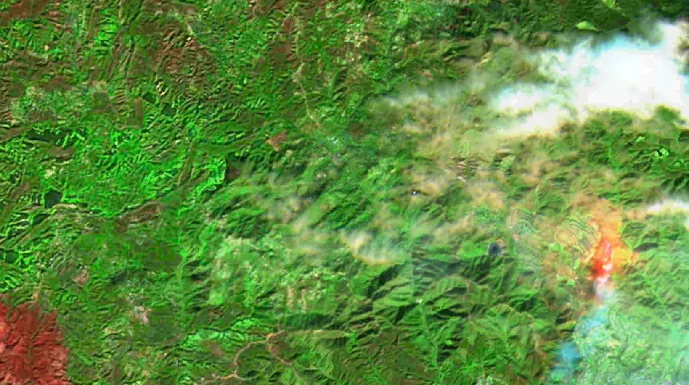
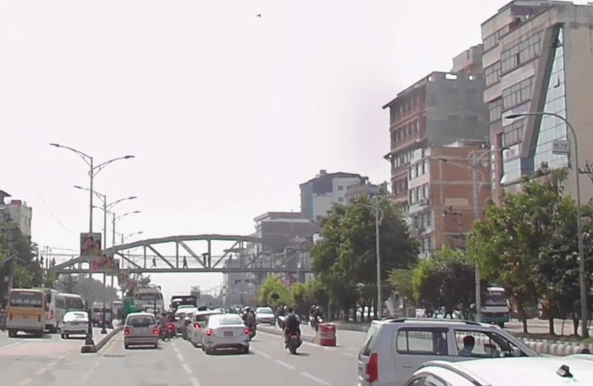
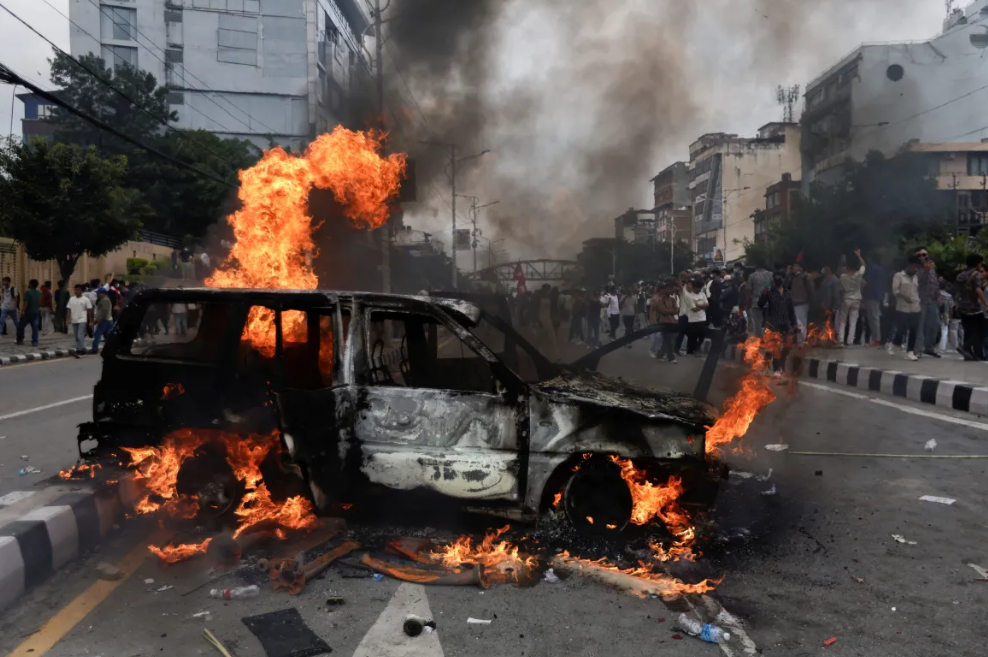
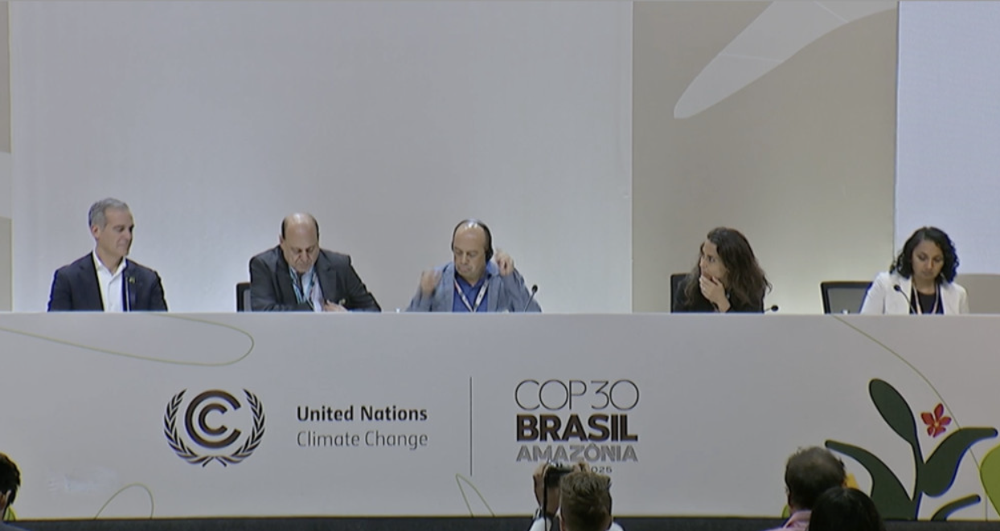
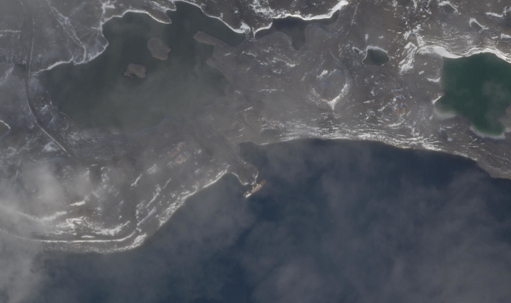
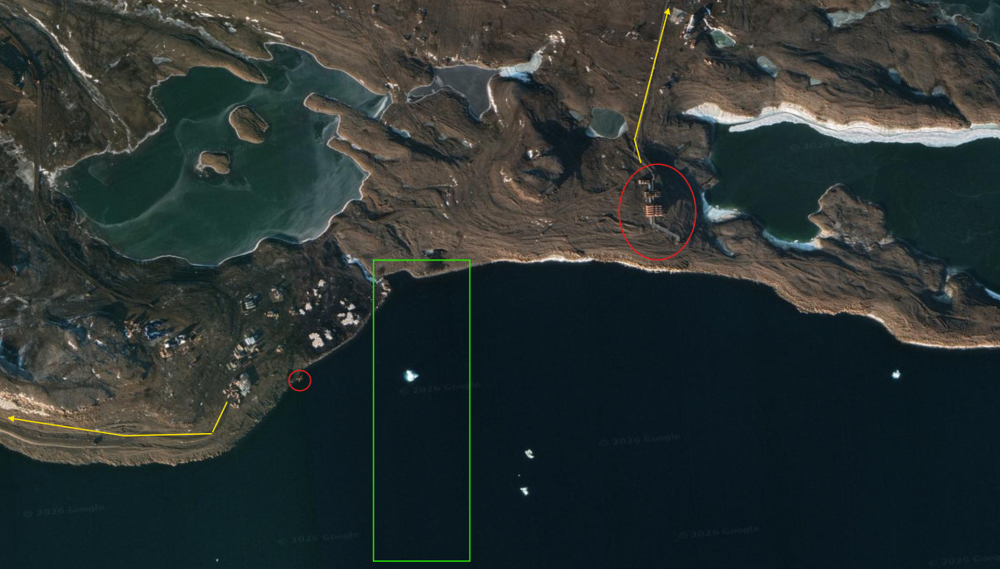
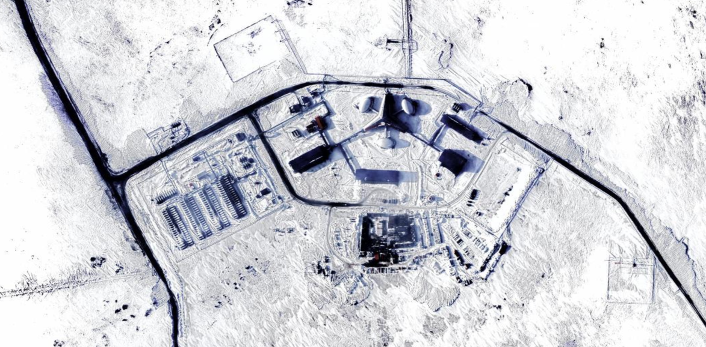
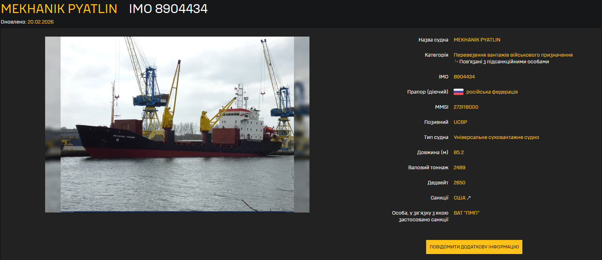
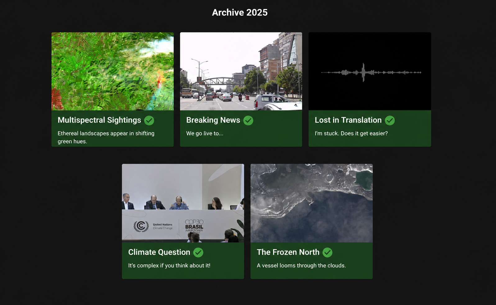

# What is Bellingcat?

[Bellingcat](https://www.bellingcat.com/) is an independent investigative collective of researchers, investigators and citizen journalists brought together by a passion for open source research. 

Founded in 2014, they have pioneered the use of open source research methods to investigate a variety of subjects of public interest. These range from the shooting down of flight MH17 over eastern Ukraine to police violence in Colombia and the illegal wildlife trade in the UAE. Their research is regularly referenced by international media and has been cited by several courts and investigative missions.

They design and share verifiable methods of ethical digital investigation. By publishing walkthroughs to open source research methods and holding tailored training sessions on their use for journalists, human rights activists and members of the public, they’re broadening the scope and application of open source research.

With over 30 staff and contributors in more than 20 countries, we operate in a unique field where advanced technology, forensic research, journalism, transparency and accountability come together. 

They believe in the need for collaboration and have partnered with news organisations across the globe. Likewise, Bellingcat’s Global Authentication Project (GAP) seeks to harness the power of the open source community by nurturing and encouraging a network of volunteer investigators. 

# How do their open source challenges work?

The complexity of these investigations reinforced something fundamental about the maturity of the modern internet: meaningful analysis requires depth of understanding before interpretation. Each challenge required a combination of advanced OSINT and analytical techniques across multiple domains.

## Multispectral Sightings

**Exact question:** Multispectral imagery can be useful for many different types of investigations, do you know what we used it for here?
On what date was this satellite imagery captured? (Answer format: DD/MM/YYYY).

This investigation revolved around geolocation under heavily altered multispectral imagery tied to a very narrow timeframe. Traditional visual anchors became unreliable almost immediately, forcing the analysis toward environmental consistency, temporal constraints, and indirect spatial correlation rather than recognizable landmarks.
The challenge highlighted how geolocation increasingly depends less on obvious identifiers and more on understanding how environments behave under transformed or degraded visual conditions.
1. Started by watching “Webinar - Advanced Use of Copernicus Browser” by “Copernicus Data Space Ecosystem” on Youtube.
2. Learned how to demodify specific layer visualizations.
3. Found what appeared to be a forest fire.
4. Found the date by correlating Google Search reverse searches and reading articles.
#### Tools used:
- **Copernicus Browser**
- **Youtube**

## Breaking News

**Exact question:** Some days are more eventful than others on this big street. Why was this street in the news this year?
What are the two last words of the title of the Al Jazeera article that used a photo taken from the same location as its header image?

At first glance, this appeared deceptively simple: identifying relevant information hidden within a large volume of nearly identical links and reports. In practice, the real difficulty came from filtering signal from noise while dealing with non-intuitive geolocation cues and fragmented contextual references.
The investigation became less about searching directly and more about constructing exclusion criteria until only a plausible chain of attribution remained.

1. Reverse searched the image, found it's city and exact location.
2. Dorked “aljazeera.com” + “Kathmandu”
3. Remembered that the precision on this challenge is to find the **location** and from there, find news containing that street but more crowded.
4. Bruteforce-checked all the articles until I found one that had two pictures explictly aligned with the bridge shown in the original content.
5. Found the last two words of the title of the article.

#### Tools used
- **TinEye**
- **Google dorking**

## Lost in Translation

**Exact question:** Some conversations can be difficult to understand when you don't speak the language. Even if you do, without context, it can be hard to track down.
In which city was this audio recorded? 

This was arguably the most conceptually unusual challenge. The task centered around analyzing extremely limited and difficult-to-obtain audio recordings before arriving at a final question that initially seemed almost unreasonable: determining the city in which the recording was captured.

1. Realised during my first time hearing the audio that both languages spoken were korean and russian. 
2. Analyzed regions in which those may occur more often (no verifiable outcomes)
3. Went back to the first step, clipped the audio in half (part korean and part russian).
4. Went to an online translator from mp3 to txt. and did that with both audio files.
5. Got the translation for both sides, the results:
6. Russian (translated):
“*Recently you have been conducting very active foreign policy activities.
I thought it would be best to meet you not in Pyongyang but here, because you can rest a bit here.
Also, you are the first foreign guest of our city, and I am very pleased that we are meeting here.
The ambassador came first. He conveyed a message of cooperation and friendship between our countries.*”
7. Got a glitched yet interesting outcome “Ambassador Hستتpassali”
8. At the same time I found the glitch, I also realised I could've enum the amount of Ambassadors that have visited DRPK.
9. Found a list containing diplomats and ambassadors that have visited North Korea, but didn't stricly stay in Pyongyang.
10. Checked correctly the city first try after confirming which previous ambassador had visited the person speaking korean in the audio.
#### Tools used: 
- **Google Maps**
- **Windows ClipChamp**
- **Google Translate**
- **AudioToText Software**

The solution depended on combining environmental audio analysis, linguistic inference, contextual elimination, and subtle infrastructural indicators. It demonstrated how intelligence attribution often emerges from weak signals that appear meaningless in isolation but become useful when layered together systematically.

## Climate Question

**Exact question:** The United Nations Climate Change Conference, COP30, took place in Belém, Brazil this year. What’s the first name of the person who asked the first audience question in the pictured session?

This challenge focused on obfuscated open-source data reconstructed through frame-by-frame analysis. The investigation required identifying fragments of foreign-language speech and correlating them against contextual indicators surrounding the 2025 United Nations COP30 timeframe.

1. Found several hours of footage on Youtube of the COP30 being held in multiple places across a few days.
2. Considered how long each question was taking to be absorbed, interpreted and properly answered I found a pattern: questions and answers take at least 30 seconds.
3. Decided to skip every video I watched by skipping 5 by 5 seconds by clicking on the right key.
4. Did that for around 30h worth of footage. Didn't find a frame of that exact board.
5. Decided to do the same but reframed my starting point. Found a specific government-based (Brazil) link which contained lots of short-to-intermediate length videos.
6. Checked all of them and almost got tricked, then, got the correct answer afterwards.
#### Tools used:
- **Google/Youtube**
- **Patience**
- **Focus**
- **The right key on the keyboard**

What made the exercise compelling was the necessity of moving between visual analysis, temporal reconstruction, translation inference, and geopolitical context simultaneously. No single method produced the answer independently.

## The Frozen North

**Exact question:** The Frozen North. A vessel looms through the clouds. This vessel is docked at an icy port, we’re lucky to even be able to see it through a gap in the clouds. But where is it and what is the vessel? What is the IMO number of the pictured vessel?

The most technically disorienting challenge involved a combination of reverse timeframing, maritime intelligence analysis, and unconventional geolocation across Arctic Circle ports and vessels. The investigation incorporated vessel tracking logic, IMO attribution, reverse URL analysis, and timeline reconstruction under incomplete information.

1. Immediately reverse searched the image (only found a bunch of forest fires news, nothing that seemed fitting)
2. Zoomed in and out several times and realised a few patterns
3. Realised it was a port in a freezing region.
4. Lightning quick word insights came to mind: arctic, vessel, port, IMO, sub-arctic, military bases, research bases. 
5. Picked Russia as the biggest challenge within the context of something like this actually making sense - one of the very few knots that could be tied logically.
6. Found “Terra de Alexandra” to the west of Russia, seemingly dettached.
7. Recognized the port.

(green: port entrance pathway. red: in/out of materials. yellow: road pathway)
8. Recognized the base centre.
  
9. Used vessel format, type and functionality as seen in the pictures.
10. Went for my tools on maritime intelligence research to check if there was any calls on that port specifically.
11. Realised the URL hid the date. Conffirmed, right ship and location.
12. Found the vessel under the IMO number 8904434. 

#### Tools used:
1. **Google Lens**
2. **Google Earth**
3. **Planet Explorer**
4. **WarSanctions**

All of these challenges took me in between 20 to 60 minutes to complete.  
This is a great view into the world of intelligence gathering, analysis and conclusion. Challenges like these strengthen my analytical techniques by correlating and attributing intelligence for structured reasoning.

