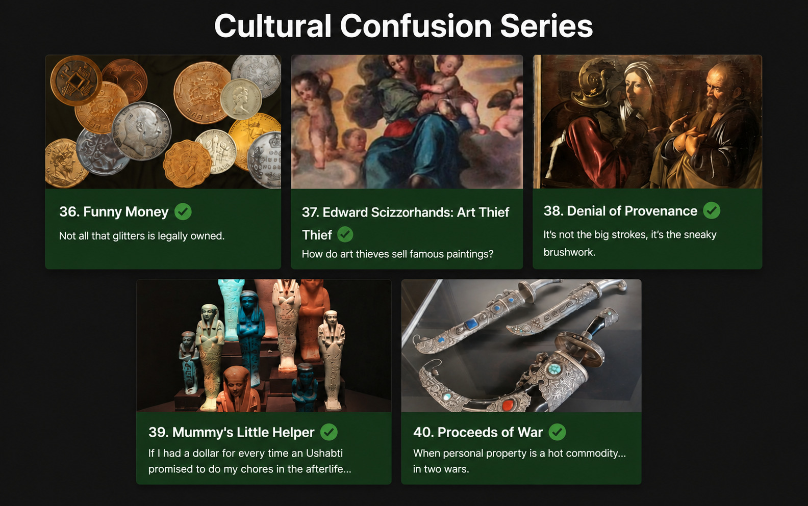
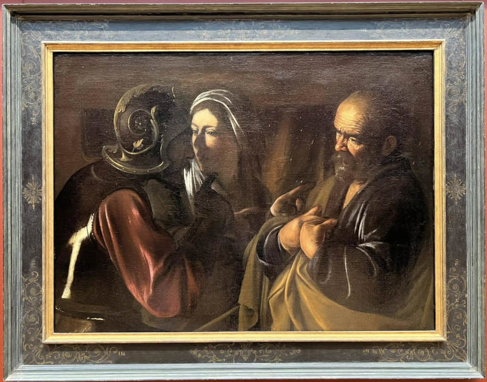
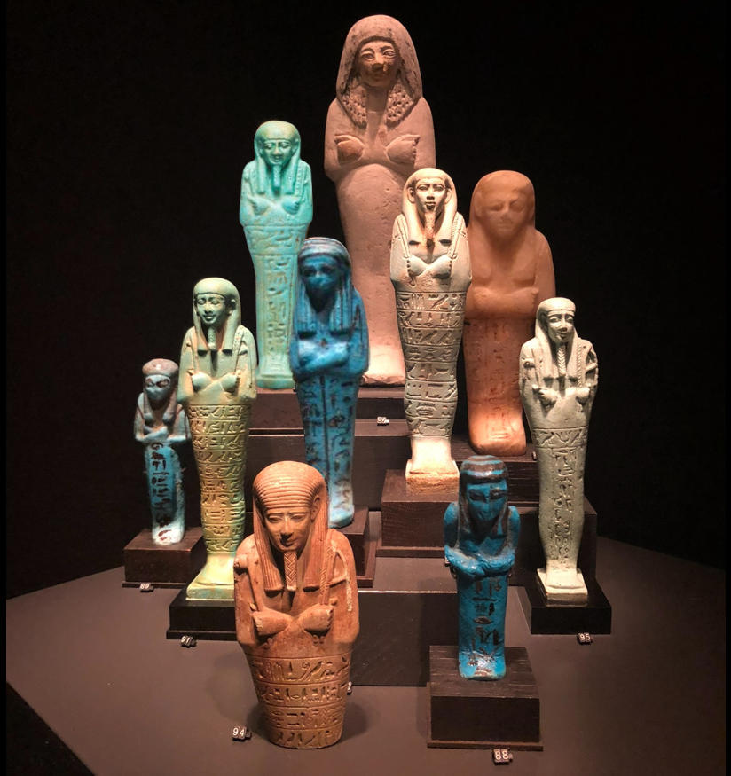
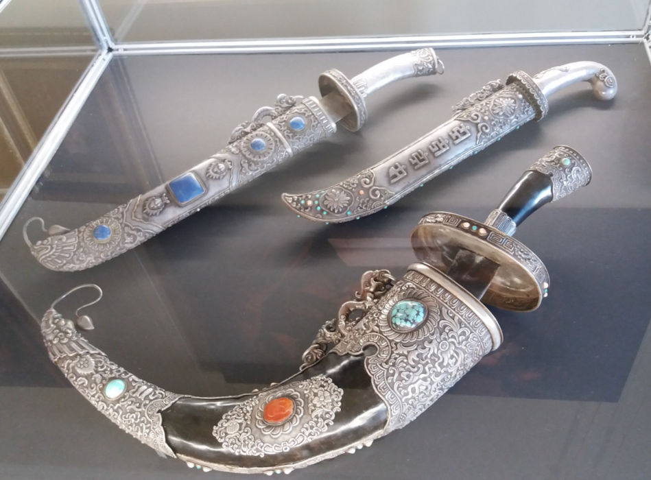
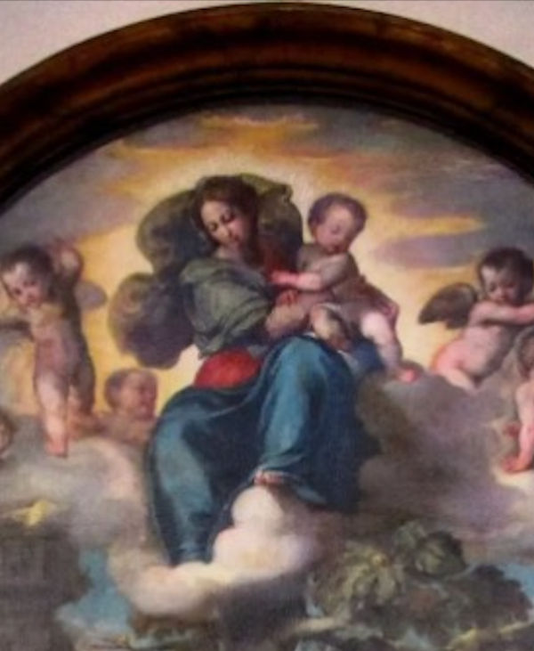
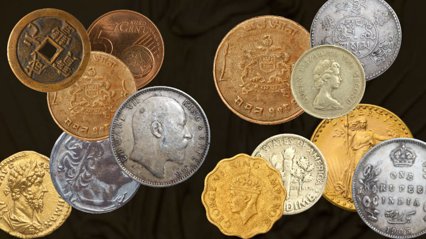

+++
title = 'Bellingcat–ARCA: Uncovering Cultural Crime Through Open Source Intelligence'
date = '2026-07-23T01:08:09-03:00'
draft = false
tags = ["OSINT", "intelligence", "technopolitics"]
categories = ["Cyber Threat Intelligence Research"]
image = "featurebanner.png"
+++

## What is Bellingcat?

[Bellingcat](https://www.bellingcat.com/) is an independent investigative collective of researchers, investigators and citizen journalists brought together by a passion for open source research. 

Founded in 2014, they have pioneered the use of open source research methods to investigate a variety of subjects of public interest. These range from the shooting down of flight MH17 over eastern Ukraine to police violence in Colombia and the illegal wildlife trade in the UAE. Their research is regularly referenced by international media and has been cited by several courts and investigative missions.

They design and share verifiable methods of ethical digital investigation. By publishing walkthroughs to open source research methods and holding tailored training sessions on their use for journalists, human rights activists and members of the public, they’re broadening the scope and application of open source research.

With over 30 staff and contributors in more than 20 countries, we operate in a unique field where advanced technology, forensic research, journalism, transparency and accountability come together. 

They believe in the need for collaboration and have partnered with news organisations across the globe. Likewise, Bellingcat’s Global Authentication Project (GAP) seeks to harness the power of the open source community by nurturing and encouraging a network of volunteer investigators. 

## How do their open source challenges work?

The complexity of these investigations reinforced something fundamental about the maturity of the modern internet: meaningful analysis requires depth of understanding before interpretation. Each challenge required a combination of advanced OSINT and analytical techniques across multiple domains.

## Cultural Confusion Series Explained

This series of challenges were created by The Association for Research into Crimes against Art (ARCA), a research organisation dedicated to the study of art crime and promotes the protection of cultural heritage. They also develop training programmes and other materials to advance the field, including these challenges. They offer a great introduction to ARCA’s field of work, but please note these challenges are intended for educational purposes only. Check out their website: https://www.artcrimeresearch.org/ 

## Challenges:
### Denial of Provenance

**Exact question**: Identifying stolen art involves more than just finding a matching photo...

Sometimes, artworks lack supporting documentation or have legitimate gaps in their circulation histories. But sometimes gaps in ownership, suspicious dealers, or phrases like "from a private Swiss collection" can indicate that an artwork may have a contentious history.

At times the names and locations of problematic handlers are intentionally omitted or obfuscated from sales records and other published information.

It appears that the accession record contains a mistake in the provenance record regarding one of the possessors, which could hide a darker history.

What is the name of the venue where this possessor met a client on 14 May 1942?

Tools used:
- Google Lens
- Google Dorking

#### Process

1. Dorked (each word by search): "the denial of saint peter" + "controversy" + 1942 + "venue"
2. "Metropolitan Museum of Art" was a frequent.
3. Subsections in Wikipedia led to "Art Looting Investigation Unit"
4. Related the date to historical events and kept the dork going, specifically looking for ALIU and the Metropolitan Museum of Art.
5. Found the name Hermann Göring, war criminal from Nazi germany. Found his "Personal properties" section on Wikipedia, OSS ALIU Red Flag Names List named him 135 times.
6. Googled "where did nazis exchange loots": got this result https://en.wikipedia.org/wiki/Nazi_plunder#Nazi_storage_of_looted_objects
7. Answer found.

### Mummy's Little Helper

**Exact question**: If I had a dollar for every time an Ushabti promised to do my chores in the afterlife...

When you shop for Ushabtis…

Ushabtis are funerary figurines placed in ancient Egyptian tombs, intended to act as servants for the deceased in the afterlife. Many bear inscriptions of a spell from the Book of the Dead commanding the figurine to answer in the deceased's place when called upon. These inscriptions typically also include the name of the deceased and a directive to perform duties without hesitation.

Ushabtis are typically made from faience, wood, or stone, and first appeared in tombs during the Middle Kingdom, evolving in form and function through the Late Period. When an Ushabti on the art market has an inscription matching one left behind in a looted tomb, it can be an indicator that it might have been looted from the same tomb.

We don't know the provenance of the ushabtis depicted in this photo, but we know one was purchased in London in 2013 for £937.50 (including premium)... but which one?

Which auction house hosted the sale, and who was the ushabti made to serve? (Answer format: "{auction house} {the name of the person this Ushabti was intended to serve}"

#### Process

1. Dorked (each word as counted as a single search): "ushabti" + "auction" + "london" + £937.50
2. Bonham's website shows up first, mentions the exact price £937.50 and the words "Auction" and "Ushabti"
3. https://www.bonhams.com/auction/20667/lot/337/an-egyptian-turquoise-glazed-composition-shabti-for-semataui/
4. Answer found. 

### Proceeds of War

**Exact question:** When personal property is a hot commodity... in two wars.

Nothing says 'war booty' like a looted dagger and questionable paperwork.

At least one of the curving scabbards in this photo, inlaid on each side and owned by a famous individual, was listed recently on the dark web for an astronomically high sum.

Having attacked the Japanese-held territories in China and Korea during the final weeks of World War II, the Soviet army invaded Manchuria and captured the owner of this weapon as he attempted to flee China for Japan.

Despite China's demands that the Kremlin return the POW so he could be tried as a war criminal, the man remained in Soviet custody for years. Desperate not to be handed back to the Chinese, the prisoner made several requests for permanent asylum. He petitioned Joseph Stalin directly and gave his collection to the government of the USSR, which took him up on his donation and then handed him back to China anyway.

What happened to the bulk of this gentleman's treasure after World War II is murky. We do know it travelled from Russia to Ukraine and was displayed as part of a private collection tied to two wealthy Ukrainians.

In 2023, the Security Service of Ukraine (SBU) detained the collection as the Asian pieces were being transported out of Ukraine and into Europe.

Based on public media reports, what is the presumed nationality of the dark web seller?

#### Process 

1. Googled the last part of the question.
2. Euromaidan Press article named "Spain detains smugglers of Ukraine’s historic artifacts worth over USD 63 mln" had the answer within it.
3. Found the answer.

### Edward Scizzorhands: Art Thief

**Exact question:** How do art thieves sell famous paintings?

The whole is greater than the sum of its parts.

Sometimes, a large or famous painting stolen from a church might draw a lot of attention if sold via the regular art market. But how do art thieves avoid the heat?

In 1982, thieves broke into a cathedral and cut away a small portion of this large-scale painting. After the theft, the cut-out canvas changed hands several times over 35 years before eventually ending up at an auction where careful eyes spotted it.

What is the name of the auction house where this canvas extract was put up for auction?

#### Process
1. Google Lens used on the picture to expand the painting, then made a profile recon on the piece, author and period.
2. Dorked "federico barocci + 1982 + stolen"
3. Found article named "The incredible story of Federico Barocci's rediscovered fragment" by italian digital magazine focused on the history of the arts, Finestre sull'Arte.
4. Found the answer.

### Funny Money

**Exact question:** 

Are you a Numismatic Gumshoe?

Not all that glitters is legally owned.

In 1933, a batch of rare coins was struck but never issued for use as currency. While nearly half a million were minted, only one coin of its type was made legal for circulation. Sold in the last decade for almost $20 million, all other versions of the coin, minted in 1933, were never officially released and were ordered to be melted down.

Despite this, a small number of these coins were not destroyed and were acquired by coin dealers under suspicious circumstances. The descendants of one of these dealers took the government to court over whether they could be considered the rightful owners of some of these stolen coins.

What is the name of the attorney that argued the appeal on behalf of this family?

#### Process

1. Googled: "richard beale numismatics lawyers name family"
2. Found the entire story written by BBC in an article named "Auctioneer exposed by BBC admits illegally selling rare ancient coins"
3. Traced back the case to 1933, mentioned in the question.
4. Googled the year, specified search by coin-collecting websites.
5. Found the article "Langbord family loses in 1933 double eagle case" on CoinWorld, mentioning the answer directly.
6. Found the answer.