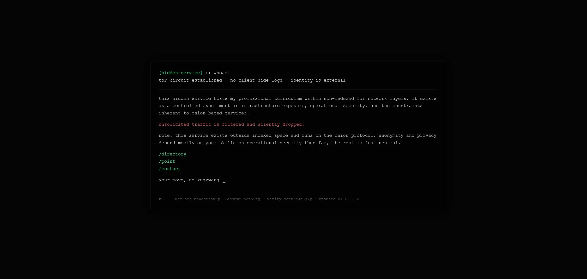

+++
date = '2026-05-24T02:27:08-03:00'
draft = false
title = 'I set up my resume on the deep web as a cyber threat intelligence project'
+++

## Project Overview
This project was not built to chase anonymity, nor to aestheticize the deep web. It exists as a practical exercise in understanding how threat infrastructure behaves when removed from indexed space.

Tor hidden services impose constraints that are easy to describe but harder to internalize without direct contact: limited visibility, asymmetric information, fragile operational security, and an environment where small configuration choices leave disproportionate analytical traces. Within a Cyber Threat Intelligence (CTI) workflow, these constraints are not theoretical; they define what can and cannot be observed, inferred, or attributed.

By deploying and hardening a minimal onion service, I was less interested in hosting content than in observing the boundaries of exposure: what remains visible despite protocol protections, how infrastructure decisions imply operator intent, and where anonymity degrades into identifiable pattern. This mirrors the conditions analysts face when examining leak sites, marketplaces, and auxiliary services across non-indexed networks.

The service is intentionally static, non-interactive, and limited in scope, it is meant to be boring. This is not an attempt to simulate immediate threat activity or operational risk, but to understand the surface that threat actors themselves can often misunderstand. Anonymity here is treated not as a property of the network, but rather as a function of discipline, tradeoffs, and failure modes.

From an intelligence perspective, the service is sparse but not opaque. An analyst could still form provisional hypotheses based on what is absent as much as what is present: interaction patterns, response consistency, content stability, update cadence, and the balance between simplicity and hardening. These signals are weak in isolation and easily misread, which is precisely the point. Tor constrains inference; it does not eliminate it.

A parallel risk in this environment is analytical overreach. The presence of a hidden service alone does not imply sophistication, affiliation, or malicious intent. Part of the exercise is recognizing where attribution pressure exceeds available evidence, and where confidence must remain explicitly bounded. In practice, much of CTI work occurs in this space: reasoning under constraint, resisting narrative completion, and documenting uncertainty as a first class output.

In intelligence work, familiarity with an environment is not measured by proximity to it, but by the ability to reason about its limits. This project reflects that orientation by remaining controlled, observant, and deliberately narrow, with the aim of clarifying how deep web threat landscapes actually operate, not how they are mythologized.

For those interested in accessing the artifact itself, the non-interactive onion service is available here:

rv2ijwmksml5brayc6lev6zptjqimeu3ypapxrurwavdjtdwjueaqvad.onion

### Key Tools Used:
* **Tor Network** for hosting the hidden service.
* **Log Analytics** to track incoming connections.

Here is a quick look at the architecture:

