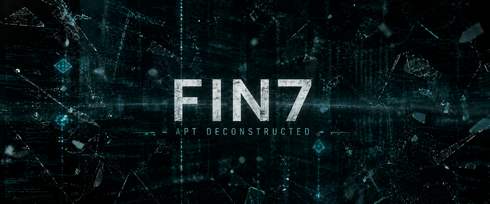

+++
title = 'FIN7 APT Report - Organizational Structure, Operational Evolution, and Intelligence Assessment in 2026'
date = '2026-07-23T01:08:09-03:00'
draft = false
tags = ["cybersecurity", "APTs", "OSINT"]
categories = ["Cyber Threat Intelligence Research"]
+++

# Assessment with SANS Intelligence Analyst's Playbook:

**Report date:** 23 July 2026,

**Reporting period covered:** 2026,

**Prepared using:** The Intelligence Analyst's Playbook (BLUF/KJ/Evidence/Analysis/Alternatives/Implications/Outlook structure; ACH; Admiralty/NATO source rating; Dator's Four Futures; STEEP+S),

**Distribution:** security researchers, cyber threat intelligence researchers, executive risk stakeholders, recruiters, cybersecurity engineers (emphasis on malware distribution and culture).

---

## What is FIN7?
[FIN7](https://attack.mitre.org/groups/G0046) (aka: ATK32, CARBON SPIDER, Calcium, Carbanak, Carbon Spider, Coreid, ELBRUS, G0008, G0046, GOLD NIAGARA, JokerStash, Sangria Tempest) is a financially-motivated threat group that has been active since 2013. [FIN7](https://attack.mitre.org/groups/G0046) has targeted the retail, restaurant, hospitality, software, consulting, financial services, medical equipment, cloud services, media, food and beverage, transportation, pharmaceutical, and utilities industries in the United States. A portion of [FIN7](https://attack.mitre.org/groups/G0046) was operated out of a front company called Combi Security and often used point-of-sale malware for targeting efforts. Since 2020, [FIN7](https://attack.mitre.org/groups/G0046) shifted operations to big game hunting (BGH), including use of [REvil](https://attack.mitre.org/software/S0496) ransomware and their own Ransomware-as-a-Service (RaaS), Darkside. FIN7 may be linked to the [Carbanak](https://attack.mitre.org/groups/G0008) Group, but multiple threat groups have been observed using [Carbanak](https://attack.mitre.org/software/S0030), leading these groups to be tracked separately. (https://attack.mitre.org/groups/G0046/ and https://malpedia.caad.fkie.fraunhofer.de/actor/fin7)

## 1. Bottom Line Up Front (BLUF)

FIN7 is almost certainly still an active, evolving criminal enterprise as of mid-2026, operating not as a single rigid hierarchy but as a federation of semi-autonomous clusters (publicly tracked under sub-designations including GrayAlpha, WaterSeed, and several unnamed STAC-series groupings) that share malware codebases, hosting infrastructure, and - in at least one high-confidence case - literal license identifiers embedded in tooling. The group has continued to broaden its initial-access repertoire beyond legacy spear-phishing into collaboration-platform abuse (Microsoft Teams vishing, Quick Assist social engineering), malvertising/SEO-poisoned software-update lures, and AI-themed honeypots (fraudulent "deepfake nudify" sites), while continuing to function as an access/tooling supplier to ransomware ecosystems rather than operating a single branded RaaS program of its own. The most important implication for defenders: signature- and indicator-based defense is a losing strategy against this actor; identity-platform hardening, EDR tamper-resistance, and behavioral detection of its persistent TTP patterns (PowerShell execution-bypass chains, Kerberoasting, RDP lateral movement) offer materially better protection than IOC blocklists, which rotate faster than they can be distributed.

---

## 2. Key Judgments

1. **We assess it is ALMOST CERTAIN (93–99%)** that FIN7, in some organizational form, remains an active and technically capable criminal enterprise as of this reporting period, rather than having been effectively dismantled by the 2018 indictments or subsequent individual arrests. *Basis: continuous vendor-documented tooling development (Anubis backdoor, PowerNet/MaskBat loaders) through 2025–2026, and MITRE ATT&CK's continued active maintenance of the group's designation (G0046) as recently as May 2026.*

2. **We assess it is VERY LIKELY (85–92%)** that FIN7 today operates as a federated network of semi-autonomous sub-clusters sharing a common tooling and infrastructure lineage, rather than as a single centrally commanded hierarchy or as entirely unrelated actors coincidentally reusing leaked code. *Basis: shared "usradm" code artifacts and identical hardcoded NetSupport RAT license identifiers observed across the GrayAlpha and WaterSeed clusters; see Section 6 (Alternatives/ACH) for the full competing-hypotheses analysis.*

3. **We assess it is LIKELY (70–84%)** that FIN7 continues to function primarily as an initial-access broker and tooling supplier to third-party ransomware operations, most recently ecosystems descended from or adjacent to Black Basta and Cl0p, rather than operating a single exclusive, branded ransomware program of its own since the retirement of DarkSide/BlackMatter.

4. **We assess it is LIKELY (70–84%)** that FIN7 has structurally deprioritized email-attachment spear-phishing as its primary access vector in favor of (a) collaboration-platform social engineering (Teams-based vishing, email-bombing precursors, Quick Assist abuse) and (b) malvertising/fake-software-update lures, while retaining legacy techniques as a secondary, lower-cost channel.

5. **We assess it is PROBABLE (55–69%)** that a persistent core malware-development function, distinct from the rotating cast of access-brokers, money mules, and unwitting recruits obtained through front companies, has continued largely uninterrupted since at least 2018, which best explains why individual prosecutions have not visibly degraded the group's tooling pipeline. *Confidence is capped at PROBABLE because no open-source reporting has directly identified current members of this presumed core development function.*

---

## 3. Evidence Summary

The evidence base for this assessment is exclusively open-source: private-sector cybersecurity vendor research, U.S. Department of Justice court records and press releases, the MITRE ATT&CK community knowledge base, and specialist journalism. No classified or government-restricted material informs this product.

**Source-type breakdown:**
- **Primary legal record (closest OSINT analogue to a controlled/confirmed source):** DOJ indictments, plea agreements, and sentencing memoranda for five identified FIN7 members (Fedorov, Hladyr, Kolpakov, and others prosecuted 2018–2022).
- **Vendor technical/forensic reporting:** Malware reverse-engineering, C2 infrastructure mapping, and code-similarity analysis from Mandiant/Google Cloud, Microsoft Threat Intelligence, SentinelOne/SentinelLabs, Recorded Future/Insikt Group, Sophos MDR, PRODAFT, G DATA, eSentire, and Silent Push.
- **Community-maintained knowledge base:** MITRE ATT&CK Group G0046, which aggregates and cross-references multiple vendors' independent reporting under a single tracked entity.
- **Derivative journalism:** Reporting (Hacker News, BleepingComputer, SC Media, etc.) that summarizes and republishes vendor findings; useful for corroboration and dating but treated as secondary to the underlying vendor report wherever both are available.

**Admiralty/NATO rating of the evidence base as a whole:** Predominantly **B2 (Usually Reliable source / Probably True information)**. Individual vendors have consistent track records and disclose their methodology (samples, hashes, infrastructure pivots), but attribution of newer sub-clusters to "FIN7" frequently rests on a single vendor's code-overlap judgment rather than independent multi-source confirmation, this is the evidence base's principal weakness (see below).

**Strongest link in the evidence chain:** The 2018–2022 DOJ court record. This is a **A1 (Completely Reliable / Confirmed)** source for the group's foundational structure, front-company use (Combi Security), and scale of harm (100+ U.S. companies across 47 states, plus U.K., Australia, and French victims, and over $1 billion in estimated aggregate damage). It anchors everything else in this report.

**Weakest link in the evidence chain:** Attribution of post-2023 sub-clusters (GrayAlpha, WaterSeed, STAC5143) to "FIN7 proper" rather than to imitators, former affiliates operating independently, or coincidental reuse of leaked tooling. Sophos itself rates its STAC5143–FIN7 linkage as only medium confidence; Recorded Future's GrayAlpha–FIN7 linkage rests on code-fingerprint and infrastructure overlap rather than a confirmed personnel or command connection. This is the single most consequential evidentiary gap in current FIN7 reporting and is addressed directly in the Alternatives section below.

**A note on source hygiene:** One widely syndicated article on a 2020-era FIN7 member's arrest contains an internally inconsistent date reference (a cited chat log dated after the article's own publication date). That source is rated **D3 (Not Usually Reliable / Possibly True)** in the Reference Register and is not used for any fact not independently corroborated by the underlying DOJ record, an illustration of the CRAAP "Accuracy" check catching an internally inconsistent source before it entered the analytic line.

---

## 4. Analysis

*Structured analytic techniques applied: Analysis of Competing Hypotheses (Section 5), a Key Assumptions Check (challenging the implicit assumption that "FIN7" denotes one continuous organization), and timeline/pattern-of-life reconstruction (below). Evidence-to-judgment traceability is maintained via the Reference Register IDs [R#].*

### 4.1 Organizational Evolution, Timeline

*Dates are used in this subsection specifically to make the group's organizational and operational transition legible; the remainder of this report treats FIN7 in the present tense as a live, currently operating threat.*

| Period | Development |
|---|---|
| **2012–2013** | Emergence of the actor cluster later designated FIN7; earliest activity centers on point-of-sale (POS) malware targeting card-present transactions [R7, R27]. |
| **2015–2018** | Large-scale POS compromise campaign against the U.S. restaurant, hospitality, gaming, and retail sectors; DOJ later documents over 100 U.S. companies across 47 states, plus victims in the U.K., Australia, and France, and more than 20 million stolen payment-card records [R1]. Operations are partly run through a front company, **Combi Security**, posing as a Moscow/Haifa-based penetration-testing firm to recruit unwitting technical staff [R1]. |
| **1 Aug 2018** | DOJ unseals indictments against three high-ranking members, Dmytro Fedorov, Fedir Hladyr, Andrii Kolpakov, publicly detailing the group's role structure (managers, "pen-testers," developers) [R1]. |
| **Apr–Jun 2021** | Hladyr sentenced to 10 years; Kolpakov sentenced to 7 years and ordered to pay restitution [R2, R3]. |
| **~2020 onward** | Strategic pivot from broad POS card-theft toward "big-game hunting", targeted intrusions against larger organizations culminating in ransomware deployment, initially via affiliation with existing RaaS brands (REvil, and precursor activity ahead of Maze/Ryuk deployments) [R25, R27]. |
| **Oct 2021** | A second front company, **Bastion Secure**, is exposed recruiting programmers and systems administrators under the guise of legitimate penetration-testing contracts, again without recruits' knowledge of the ultimate criminal purpose [R5, R6]. |
| **Jan 2022** | FBI warns that the group is mailing malicious USB devices ("BadUSB") to U.S. companies while impersonating Amazon and the U.S. Department of Health and Human Services [R25]. |
| **2022** | A further member, Denys Iarmak, is sentenced for continued participation in the conspiracy even after the 2018 arrests of co-conspirators, evidence the enterprise survived its first wave of prosecutions [R4]. |
| **Nov 2022** | SentinelLabs assesses it is likely that the developer of a custom EDR-evasion toolset used exclusively by the emergent Black Basta ransomware operation is, or was, a FIN7 developer, the first strong technical link between FIN7 and a "new-generation" ransomware brand [R11]. |
| **Apr 2023** | Microsoft (tracking the actor as **Sangria Tempest**) documents the group's return to direct ransomware deployment, using the PowerShell tool POWERTRASH to load the Lizar/DICELOADER post-exploitation framework, then OpenSSH and Impacket for lateral movement and Windows credential access, culminating in Cl0p ransomware deployment [R9]. This activity overlaps with exploitation of the PaperCut vulnerability (CVE-2023-27350) attributed to a partner cluster tracked by Microsoft as Lace Tempest/DEV-0950 [R10]. |
| **Jul 2024** | SentinelOne documents continued commercial sale of the EDR-impairment tool **AvNeutralizer** (aka AuKill) on Russian-language cybercrime forums (xss[.]is, exploit[.]in) under rotating pseudonyms (goodsoft, lefroggy, killerAV, Stupor), priced between roughly $4,000 and $15,000, and assessed with high confidence to be the same operator cluster [R12]. By this point the tool has been used in intrusions tied to at least six distinct ransomware brands beyond Black Basta, including AvosLocker, MedusaLocker, BlackCat/ALPHV, Trigona, and LockBit [R11, R12]. |
| **Apr–May 2024** | Malvertising campaigns abusing Google Ads and signed MSIX application packages (impersonating AnyDesk, WinSCP, BlackRock, Asana, Concur, The Wall Street Journal, Workable, and Google Meet) deliver NetSupport RAT and DICELOADER [R18]. |
| **Oct 2024** | Silent Push identifies a network of fraudulent AI "deepfake nudify" websites (branded around "AINude.ai") operated by FIN7 infrastructure, distributing Lumma Stealer, RedLine Stealer, and the D3F@ck Loader malware-as-a-service; more than 4,000 associated domains and IPs are catalogued, at the time, the largest FIN7 infrastructure footprint publicly documented [R16, R17]. |
| **Jan 2025** | Sophos MDR documents two related but distinct threat clusters, **STAC5143** and **STAC5777**, using email-bombing followed by Microsoft Teams-based vishing (voice phishing) impersonating internal IT support, in some cases leading victims to install Quick Assist for hands-on-keyboard access. Sophos assesses with **medium confidence** that STAC5143's Python tooling is connected to FIN7/Sangria Tempest [R21]. |
| **Mar 2025** | PRODAFT and G DATA independently document a new Python-based backdoor, **Anubis**, delivered via compromised SharePoint sites and malicious spam, giving full remote shell command execution over Windows hosts [R13, R14]. |
| **Mar 2025** | PRODAFT documents shared use of a modular toolkit, **Ragnar Loader** (aka Sardonic), across FIN7, FIN8, Ragnar Locker, and a post-REvil cluster tracked as "Ruthless Mantis", evidence of tooling exchange across nominally distinct criminal groups [R24]. |
| **Jun 2025** | Recorded Future's Insikt Group documents **GrayAlpha**, a cluster overlapping with FIN7's **WaterSeed** sub-group, using two new custom loaders (PowerNet, MaskBat) and three parallel infection vectors, fake browser-update pages, fraudulent 7-Zip download sites, and a previously undocumented traffic-distribution system (TAG-124), to deploy NetSupport RAT. Nearly three-quarters of the associated NetSupport RAT samples share just two hardcoded license identifiers previously tied to earlier FIN7 activity [R19, R20]. |
| **Oct 2025** | Microsoft's threat-disruption reporting names Sangria Tempest as one of five active clusters (alongside Storm-1811, Storm-2372, Storm-0324, and Storm-1674) abusing Microsoft Teams as a delivery and persistence channel; a related cluster, Storm-0324, is reported to deliver a custom JSSLoader payload that in turn provisions access for Sangria Tempest operators [R22]. This builds on a late-2024 campaign ("VEILdrive") in which Sangria Tempest and Storm-1674 used previously compromised accounts to impersonate IT personnel across organizational boundaries via Teams [R22]. |
| **Jan 2026** | Microsoft begins rolling out baseline Teams messaging-safety protections by default across tenants, a direct platform-level response to the abuse pattern documented above [R23]. |
| **12 May 2026** | MITRE ATT&CK's Group G0046 (FIN7) entry is last modified, with contributions credited to multiple independent vendor analysts, confirming the group remains a live, actively maintained tracking entity rather than a closed historical case [R27]. |

### 4.2 Current Structure: The Federated Cluster Model

As of this reporting period, "FIN7" is best understood analytically not as a single cell but as a **lineage**, a persistent core of malware development, hosting infrastructure, and tradecraft conventions that surfaces across multiple externally tracked clusters, at least some of which operate with meaningful autonomy:

- **Core/legacy operations**, direct use of POWERTRASH, DICELOADER (Lizar/Tirion), TERMITE, and POWERPLANT in intrusions leading to Cl0p or Black-Basta-lineage ransomware deployment (tracked by Microsoft as Sangria Tempest).
- **WaterSeed**, a sub-cluster associated with the "Usradm Loader" tool, sharing code fingerprints with GrayAlpha [R20].
- **GrayAlpha**, a cluster deploying the PowerNet and MaskBat loaders via fake software-update and 7-Zip download sites and the TAG-124 traffic-distribution system, tied to WaterSeed by shared code strings and to core FIN7 activity by reused NetSupport RAT license identifiers [R19].
- **STAC5143** (Sophos designation), a Teams-vishing/email-bombing cluster assessed with medium confidence to be FIN7-linked [R21].
- **The AvNeutralizer commercialization channel**, a criminal-forum-facing "product line" through which core FIN7 tooling is sold onward to unrelated ransomware operators, functionally decoupling tool development from tool use [R11, R12].

This structure is consistent with, though not proof of, a deliberate compartmentalization strategy: distributing operational risk across nominally separate clusters and even monetizing tools to third parties, such that no single arrest, takedown, or vendor attribution can meaningfully disable the whole.

### 4.3 TTP / MITRE ATT&CK Mapping (illustrative, non-exhaustive)

| Tactic | Technique | Observed FIN7 Behavior |
|---|---|---|
| Initial Access | T1566.001 Spearphishing Attachment | Malicious documents themed on SEC filings, catering/business inquiries, and IT/HR pretexts [R7, R8]. |
| Initial Access | T1189 Drive-by Compromise | Malvertising and fake software-update pages delivering MSIX installers [R18, R19]. |
| Initial Access | T1195.002 Compromise Software Supply Chain | Trojanized Atera remote-monitoring installer distributed via a compromised digital-products website and an Amazon S3 bucket, deploying the POWERPLANT backdoor framework [R25]. |
| Initial Access | Vishing / help-desk impersonation (collaboration-platform abuse) | Microsoft Teams voice calls and chat messages impersonating internal IT support, often preceded by email-bombing to create urgency [R21, R22]. |
| Execution | T1059.001 PowerShell / T1059.005 Visual Basic | Distinctive `-ex bypass -f`/`-file` invocation patterns; VBScript droppers using DNS TXT-record C2 [R25]. |
| Defense Evasion | T1027.010 / T1027.016 Command & Junk-Code Obfuscation | Custom string-shifting obfuscation and random junk-code insertion to defeat static detection signatures [R25]. |
| Defense Evasion | T1562.001 Impair Defenses | AvNeutralizer/AuKill EDR-impairment tooling, including kernel-driver abuse (e.g., the built-in TTD Monitor Driver) to induce denial-of-service conditions in protected security processes [R11, R12]. |
| Credential Access | T1558.003 Kerberoasting | Custom PowerShell Kerberoasting modules used to extract service-account credential hashes [R25]. |
| Discovery | T1033 / T1069.002 | System/user discovery (`quser`) and domain-admin group enumeration (`net group "Domain Admins" /domain`) [R25]. |
| Lateral Movement | T1021.001 RDP; Impacket/WMI | Compromised RDP credentials; Impacket WMI modules for remote PowerShell execution and credential dumping [R9, R25]. |
| Command & Control | Custom frameworks | DICELOADER/Lizar, TERMITE, POWERPLANT, the Python-based Anubis backdoor, and Ragnar Loader-family tooling shared with FIN8 and Ragnar Locker-linked actors [R13, R14, R24]. |
| Impact | Ransomware deployment | Cl0p; historical DarkSide, BlackMatter, REvil, Maze/Ryuk precursor activity; technical linkage to Black Basta-lineage tooling [R9, R11, R30]. |

### 4.4 Current Malware & Tooling Arsenal

· POWERTRASH (PowerShell in-memory dropper).

· DICELOADER/Lizar/Tirion (post-exploitation framework).

· TERMITE (shellcode loader).

· POWERPLANT (modular backdoor framework).

· BIRDWATCH.

· Anubis (Python-based remote-access backdoor, 2025).

· PowerNet and MaskBat (PowerShell/loader pair associated with GrayAlpha, 2025).

· Usradm Loader (WaterSeed).

· AvNeutralizer/AuKill (commercialized EDR-impairment tool).

· Ragnar Loader/Sardonic (shared with FIN8 and Ragnar Locker-linked actors).

· NetSupport RAT (commodity RAT abused via signed MSIX packages).

· Carbanak (legacy backdoor historically associated with, though not exclusively used by, this actor cluster, MITRE notes multiple distinct groups have used Carbanak, complicating clean attribution) [R13, R14, R19, R20, R24, R25, R27].

### 4.5 Ransomware Ecosystem Relationships

FIN7's relationship to branded ransomware operations has consistently been that of an **enabler and access supplier** rather than a sole proprietor: precursor/affiliate activity ahead of Maze and Ryuk; direct affiliation with REvil; operation of the now-retired DarkSide and BlackMatter programs; a technically documented tooling relationship with Black Basta; and direct operational use of Cl0p since April 2023 [R9, R11, R30]. No open-source reporting in this cycle identifies FIN7 as currently operating an exclusive, self-branded RaaS program; its highest-confidence current role is as a **multi-brand initial-access and tooling supplier**.

### 4.6 Targeting Profile

Historically concentrated in U.S. restaurant, hospitality, gaming, and retail sectors, FIN7's documented victim profile has broadened over time to include software, consulting, financial services, medical equipment, cloud services, media, food and beverage, transportation, pharmaceutical, utilities, and automotive organizations [R25, R27], plus opportunistic mass-consumer targeting through the deepfake "nudify" lure network, which is not sector-specific and instead targets individuals directly [R16, R17].

---

## 5. Alternatives, Analysis of Competing Hypotheses (ACH)

**Key assumption under test:** that "FIN7" denotes a single continuous organization. This assumption is explicitly interrogated rather than accepted, consistent with a Key Assumptions Check.

**Hypotheses:**
- **H1, Unified hierarchy:** FIN7 operates today under one centralized command structure directing all attributed clusters, structurally unchanged from its 2013–2018 form.
- **H2, Federated lineage:** "FIN7" is best understood as a persistent core (development, infrastructure, tradecraft conventions) whose output is used by a rotating, partially autonomous set of sub-clusters and hired operators, some of whom may not consider themselves part of a single organization.
- **H3, Pure tooling marketplace:** FIN7's core function is malware development and initial access, sold or rented to unaffiliated third parties; ransomware deployment is carried out by financially and organizationally separate customer groups.
- **H4, Coincidental convergence:** Vendor attribution of newer clusters (GrayAlpha, WaterSeed, STAC5143) to "FIN7" is analytic overreach based on superficial code or infrastructure reuse, not a genuine organizational link.

| Evidence | H1: Unified Hierarchy | H2: Federated Lineage | H3: Pure Marketplace | H4: Coincidental Convergence |
|---|---|---|---|---|
| DOJ 2018 indictment describes graduated roles (managers, "pen-testers," developers) [R1] | C | C | I | N |
| AvNeutralizer sold openly on criminal forums under rotating aliases for cash, to buyers including competing ransomware crews [R11, R12] | I | C | C | I |
| Black Basta had exclusive use of the EDR-evasion tool for ~6 months before it was commoditized to other groups [R11] | I | C | C | I |
| Sophos rates its own STAC5143–FIN7 link as only medium confidence [R21] | I | C | N | C |
| GrayAlpha/WaterSeed share an identical code string ("usradm") and hardcoded NetSupport RAT license IDs across campaigns [R19, R20] | C | C | I | I |
| Group's tooling pipeline (Anubis, PowerNet/MaskBat) continued uninterrupted through 2025 despite arrests concluding in 2018–2022 [R1–R4, R13, R19] | I | C | C | N |
| MITRE ATT&CK maintains FIN7 as a single tracked entity (G0046) with multi-vendor contribution as of May 2026 [R27] | C (weak) | C (weak) | N | I |
| **Assessment** | **Rejected** (3 inconsistencies) | **Strongest** (0 inconsistencies) | **Weakened** (2 inconsistencies) | **Rejected** (4 inconsistencies) |

**Reading the matrix:** H2 (federated lineage) is consistent with every row and has no diagnostic inconsistencies. H1 (unified hierarchy) is undercut by the fact that a genuinely centralized organization is unlikely to openly commercialize its own defense-evasion tooling to competing ransomware crews on public criminal forums, that behavior is far more consistent with a marketplace or federated model. H3 (pure marketplace, no direct ransomware role) is weakened by the Black Basta exclusivity period and by Sangria Tempest's own direct, hands-on-keyboard involvement in Teams-vishing intrusions, both indicate a closer operational relationship to ransomware deployment than a pure arms-length supplier model would predict. H4 (coincidental convergence) is the most strongly rejected hypothesis: the reuse of an identical hardcoded license identifier across supposedly unrelated campaigns is difficult to explain except through shared tooling provenance.

**Sensitivity check:** The conclusion is moderately sensitive to the GrayAlpha/WaterSeed code-fingerprint evidence [R19, R20]. If that single data point were independently discredited, H4 would become considerably more competitive with H2, and overall confidence in Key Judgment 2 would fall from VERY LIKELY toward LIKELY. This evidentiary dependency is flagged for continued monitoring.

**What would change this assessment:** Direct identification (via law enforcement action, leaked internal communications, or a cooperating insider) of personnel overlap, or its explicit absence, between the "core" FIN7 cluster and GrayAlpha/WaterSeed/STAC-series operators would be the single most diagnostic piece of evidence available and should be the top collection priority.

---

## 6. Implications

**Operational:** Indicator-of-compromise-based defense (domains, hashes, IPs) is a persistently losing strategy against this actor, given the pace of infrastructure rotation documented across GrayAlpha's three parallel infection vectors alone. Higher-value investments: (a) identity- and collaboration-platform hardening, restricting external Teams contact by default, disabling or tightly governing Quick Assist, and treating sudden email-bombing as a precursor indicator warranting immediate triage; (b) EDR tamper-protection resilience specifically validated against AvNeutralizer-class kernel-driver abuse; (c) application allow-listing to blunt MSIX- and malvertising-based delivery; (d) behavioral detection tuned to the group's durable execution patterns (PowerShell bypass-flag invocations, Kerberoasting command sequences, RDP-to-notepad++-to-cmd process chains), which have remained stable for years even as file-level indicators have not.

**Strategic:** FIN7's demonstrated resilience through eight-plus years of individual prosecutions illustrates the limits of conviction-based deterrence against a networked, compartmentalized criminal enterprise whose core personnel are believed to reside in jurisdictions without functioning extradition cooperation with the United States. Absent a coordinated multinational infrastructure/financial disruption comparable in scale to the 2023 Qakbot takedown, individual arrests are likely to continue removing operators without meaningfully degrading the tooling lineage.

**Political:** No open-source evidence reviewed for this product indicates state direction of FIN7's operations. The group's apparent operating latitude, recruitment through CIS-region job portals, Russian-language criminal-forum activity, and members' presumed residence in jurisdictions that do not extradite to the United States, is consistent with the broader pattern of tolerance afforded to financially motivated, non-domestically-targeting cybercrime groups operating from the region, a dynamic that is itself a matter of ongoing public policy debate rather than a settled fact this product can adjudicate.

**Resource/investment:** For CTI teams, the marginal value of subscribing to vendor tracking specifically covering the GrayAlpha/WaterSeed/STAC-series clusters is likely to exceed the marginal value of additional generic FIN7 IOC feeds, given that the clusters, not the legacy "core", represent the actor's current growth edge.

---

## 7. Outlook

### 7.1 Indicators & Warning List

- New criminal-forum listings for AvNeutralizer/AuKill successor tooling, or a new EDR-impairment tool sharing its packer signature (PackXOR-family).
- Reuse of previously catalogued NetSupport RAT license identifiers in new campaigns (a strong fingerprint given past detection reliability).
- Emergence of a new traffic-distribution system in the lineage of TAG-124.
- A new ransomware brand appearing with FIN7-linked EDR-evasion or loader code shortly after launch (the pattern previously observed with Black Basta in 2022).
- Expansion of AI-themed lure infrastructure (deepfake, voice-cloning, or "AI assistant" branded honeypots) beyond the AINude.ai network.
- A new wave of Teams-vishing/email-bombing activity following any platform-level countermeasure rollout (an adaptation signal).

### 7.2 Scenario Set, Dator's Four Futures

| Archetype | Scenario for FIN7 | Assessed Likelihood |
|---|---|---|
| **Continuation** | FIN7 persists as a federated multi-cluster enterprise, incrementally rotating branding and infrastructure while continuing to supply access and tooling to third-party ransomware ecosystems. | Most probable absent external disruption; consistent with the pattern observed 2018–2026. |
| **Collapse** | A coordinated multinational law-enforcement and infrastructure-seizure action, requiring a degree of cooperation from Russian authorities not currently evident, dismantles core infrastructure and arrests key developers, fragmenting the lineage in the manner Conti's leadership dissolution fragmented that ecosystem in 2022. | Assessed unlikely in the near term given the extradition and jurisdictional constraints discussed in Section 6. |
| **Discipline** | Platform vendors (principally Microsoft) impose increasingly aggressive default-on countermeasures, Teams external-contact restrictions, Quick Assist governance, MSIX handler restrictions, mandatory EDR tamper-protection, materially raising the group's operating cost and forcing consolidation onto fewer, harder-to-detect vectors. | Plausible and partially already underway (the January 2026 Teams baseline protections are an early instance). |
| **Transformation** | FIN7 (or its successor clusters) shifts decisively toward AI-native tradecraft, automated, agentic lure generation, synthetic-voice vishing at scale, and LLM-assisted target research, fundamentally changing its detection profile from today's pattern-based tradecraft. | Plausible given sector-wide observation of a sharp rise in AI-related illicit cybercrime activity through late 2025 and into 2026; not yet confirmed specifically for this actor beyond its existing (non-agentic) use of AI-themed lures. |

### 7.3 STEEP+S Horizon Scan (FIN7-specific)

- **Security:** Collaboration-platform abuse (Teams, Quick Assist) has been industrialized across at least five actor clusters simultaneously per Microsoft's own reporting, of which FIN7/Sangria Tempest is one, meaning platform-level defenses will affect FIN7 alongside unrelated actors, complicating clean attribution of any future decline in this vector to FIN7-specific countermeasures versus broader industry hardening.
- **Technology:** Continued exploitation of AI-themed social engineering (deepfake "nudify" lures) and modular loader tooling (PowerNet/MaskBat); watch for a shift from static lure pages toward more adaptive, automated lure generation.
- **Economic:** The open commercialization of AvNeutralizer at four- and five-figure price points indicates a maturing internal cybercrime economy in which FIN7 functions partly as a tooling vendor to the broader ransomware ecosystem, not solely as an operator.
- **Legal:** The U.S. prosecution track record (five individuals convicted 2018–2022) has not been matched by any identified Treasury/OFAC financial-sanctions designation specific to FIN7 as an entity, unlike some other Russian-linked cybercrime brands. This is a notable gap in the available policy toolkit as of this reporting period, though it may reflect a policy preference for criminal prosecution over sanctions for this actor rather than a settled absence of options.
- **Societal:** The deepfake-lure network marks a deliberate expansion from enterprise-only targeting into direct, mass-scale individual targeting, broadening the group's victim pool beyond corporate network defenders into the general public.
- *(Environmental and Political dimensions assessed as not materially diagnostic for this specific actor beyond the general safe-harbor dynamic already addressed in Section 6.)*

### 7.4 Timeframe & Reassessment Triggers

Assessed to remain a live, active threat through at least mid-2027 absent a disruption comparable in scale to the 2023 Qakbot takedown. This assessment should be revisited immediately upon: (a) any law-enforcement action targeting GrayAlpha/WaterSeed/STAC-series infrastructure specifically; (b) any vendor report directly establishing or ruling out personnel overlap between core FIN7 and its sub-clusters; or (c) evidence of a qualitative shift toward agentic/AI-automated tradecraft.

---

## 8. Writing-Checklist Self-Assessment

- [x] BLUF states the assessment clearly
- [x] Every Key Judgment carries a calibrated confidence level
- [x] Every judgment traces to cited evidence (Reference Register IDs)
- [x] Alternatives addressed via full ACH matrix with sensitivity check
- [x] Active voice used throughout
- [x] No unsupported assertions, the one deliberately low-quality source (R31) is explicitly flagged rather than silently relied upon
- [x] Implications stated across operational/strategic/political/resource dimensions
- [x] Monitoring indicators and reassessment triggers defined

---

## 9. Reference Register (Admiralty/NATO-Rated)

| ID | Source (Organization) | Subject | Approx. Date | Admiralty Rating |
|---|---|---|---|---|
| R1 | U.S. Department of Justice / FBI | Indictment unsealing, three FIN7 members; Combi Security front company; victim scope | 1 Aug 2018 | A1 |
| R2 | U.S. Department of Justice | Fedir Hladyr sentencing | Apr 2021 | A1 |
| R3 | U.S. Department of Justice | Andrii Kolpakov sentencing | 24 Jun 2021 | A1 |
| R4 | U.S. Department of Justice (via secondary reporting) | Denys Iarmak sentencing; continued conspiracy post-2018 | 2022 | B2 |
| R5 | Recorded Future / Gemini Advisory | "Bastion Secure" front-company exposure | Oct 2021 | B2 |
| R6 | BleepingComputer | Derivative coverage of R5 | Oct 2021 | C2 |
| R7 | Mandiant / FireEye | SEC-filings spear-phishing campaign | Mar 2017 | B1 |
| R8 | Mandiant | "On the Hunt for FIN7" | Aug 2018 | B1 |
| R9 | Microsoft Threat Intelligence (Sangria Tempest reporting) | Cl0p ransomware deployment via POWERTRASH/Lizar | May 2023 | B2 |
| R10 | Microsoft Threat Intelligence | Lace Tempest/Sangria Tempest PaperCut overlap | 2023 | B2 |
| R11 | SentinelOne / SentinelLabs | Black Basta–FIN7 EDR-tool linkage | Nov 2022 | B2 |
| R12 | SentinelOne / SentinelLabs | "FIN7 Reboot", AvNeutralizer commercialization | Jul 2024 | B2 |
| R13 | PRODAFT | Anubis Python backdoor | Mar 2025 | B2 |
| R14 | G DATA | "Unboxing Anubis" | Mar 2025 | B2 |
| R15 | The Hacker News | Derivative coverage of R13/R14 | Apr 2025 | C2 |
| R16 | Silent Push | AINude.ai honeypot network | Oct–Dec 2024 | B2 |
| R17 | Infosecurity Magazine / BleepingComputer | Derivative coverage of R16 | Oct 2024 | C2 |
| R18 | eSentire (Threat Response Unit) | Malvertising/MSIX NetSupport RAT delivery | May 2024 | B2 |
| R19 | Recorded Future / Insikt Group | GrayAlpha/WaterSeed, PowerNet/MaskBat loaders | 13 Jun 2025 | B2 |
| R20 | SC Media | Derivative coverage of R19 | 17 Jun 2025 | C2 |
| R21 | Sophos MDR | STAC5143/STAC5777, Teams vishing, Quick Assist abuse (medium-confidence FIN7 link, self-rated) | 21 Jan 2025 | B2 (attribution component: C3) |
| R22 | Microsoft Security Blog | Teams-based threat disruption; VEILdrive; Sangria Tempest as one of five clusters | 7 Oct 2025 | B2 |
| R23 | Cloud Security Alliance (Lab Space research note) | Synthesis of R21/R22; Teams baseline-protection rollout | ~2026 | C3 |
| R24 | PRODAFT (via The Hacker News) | Ragnar Loader shared tooling (FIN7/FIN8/Ragnar Locker) | 7 Mar 2025 | B2 |
| R25 | Picus Labs | FIN7 evolution synthesis; ATT&CK/technique mapping | 24 Oct 2025 | B2 |
| R26 | Google Cloud Blog (Mandiant) | "FIN7 Power Hour: Adversary Archaeology" (referenced via R25) | n/d | B1 |
| R27 | MITRE ATT&CK | Group G0046 profile, multi-vendor contributed | Last modified 12 May 2026 | B1 |
| R28 | Malpedia (Fraunhofer FKIE) | Actor alias register | ongoing | B2 |
| R29 | Bitdefender | Sardonic/Ragnar Loader origin (referenced via R24) | 2021 | B2 |
| R30 | The Record (Recorded Future News) | FIN7–Black Basta cartel reporting | Jul 2024 | C2 |
| R31 | (Syndicated outlet, unnamed here) | Denys Iarmak arrest coverage, **internally inconsistent date reference identified; used only where independently corroborated by R4** | n/d | D3 |
| R32 | CISA / FBI StopRansomware advisory library | Absence of a dedicated FIN7-branded joint advisory (evidentiary-gap finding) | ongoing | A1 |
| R33 | Flashpoint | General 2026 cybercrime/threat-landscape context (not FIN7-specific) | Mar 2026 | B2 |
| R34 | Comparitech | General 2026 healthcare-ransomware sector context (not FIN7-specific) | 2026 | C2 |

---

## 10. Analyst's Note on Confidence and Limitations

This product was built entirely from open, publicly available reporting; it carries none of the collection advantages (technical intercepts, human sources, financial-intelligence subpoena data) available to a government intelligence service and should be weighted accordingly by any reader making operational or resourcing decisions. The single largest limitation is structural: nearly all attribution of FIN7's current sub-clusters rests on private-vendor code- and infrastructure-similarity judgments rather than confirmed personnel identification, and vendors themselves frequently, and appropriately, hedge these judgments as "medium confidence" or "overlapping with." This report has attempted to preserve that hedging faithfully rather than compressing it into false certainty, consistent with the calibrated-language discipline this product is built to model. Readers using this assessment for defensive prioritization should treat Key Judgments 1 and 3 (continued activity; access-broker role) as the most load-bearing and best-supported, and Key Judgment 5 (a persistent core development function) as the most inferential and least directly evidenced.