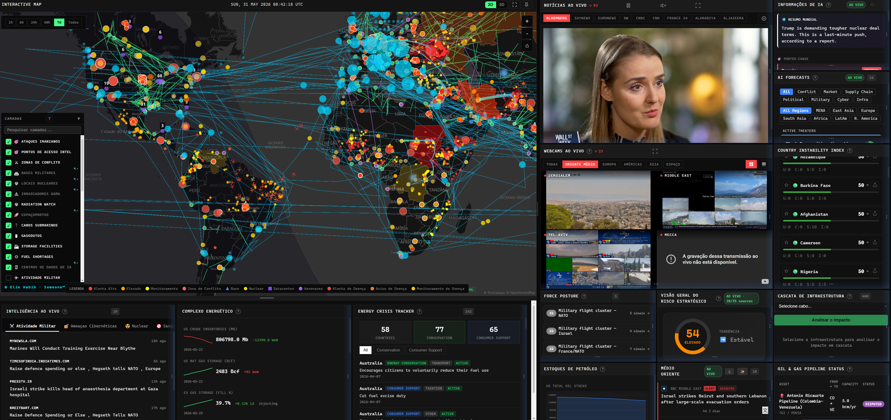
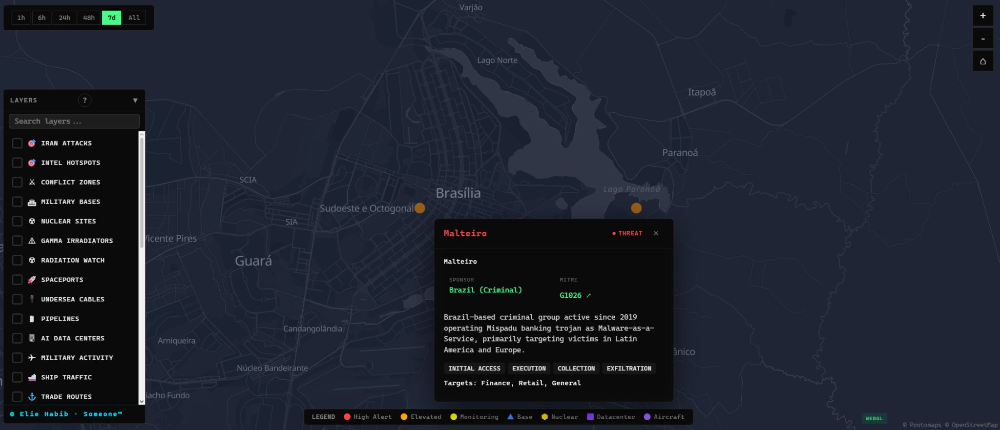

+++
date = '2026-05-26T06:10:55-03:00'
draft = false
title = 'WorldMonitor: Integrating Cyber Threat Intelligence Into Geospatial Analysis'
tags = ["geopolitics", "intelligence", "OSINT", "technopolitics"]
+++

## Overview
I have have worked on the development of the viral [World Monitor](https://www.worldmonitor.app) application, focusing on the integration of cyber threat intelligence into a geospatial analysis environment. The objective behind this work is to bridge infrastructure-level threat data with broader contextual intelligence, allowing cyber activity to be interpreted not only as isolated indicators, but also as part of larger operational and geopolitical patterns.

One of the recurring limitations within modern cyber threat intelligence is fragmentation. Malware infrastructure, infected hosts, indicators of compromise, and Advanced Persistent Threat (APT) activity are often distributed across separate platforms, feeds, and analytical layers. Tactical indicators tend to be consumed independently, while strategic attribution remains disconnected from the infrastructure generating those signals in real time.

The current work on World Monitor attempts to reduce that separation by introducing spatial visibility and contextual correlation directly into the platform’s mapping environment.

## Cyber Threat Infrastructure Layer

The first major addition focused on integrating live cyber threat infrastructure data throughout the platform’s global map interface. This includes malware-associated hosts, infected IP addresses, and additional contextual metadata designed to improve immediate situational awareness during analysis. Mostly Malware-as-a-Service / Ransomware-as-a-Service infrastructure displayed throughout the entire map.

- 1.0 **identifies** whether the infrastructure is operating as a malware host
- 1.1 **visualizes** infected or compromised IP addresses
- 1.2 **displays** country-level ccTLD attribution
- 1.3 **displays** last-seen activity using full dd/mm/year formatting alongside 24-hour clock timestamps
- 1.4 **displays** infrastructure criticality scoring for prioritization purposes

By embedding this information directly into a geospatial interface, infrastructure activity becomes easier to contextualize geographically and temporally rather than remaining confined to static feeds or isolated threat reports. This implementation improves the ability to correlate infrastructure activity across geographic regions and operational timelines within a unified analytical environment.

The second major addition focused on integrating Advanced Persistent Threat intelligence directly into the platform’s geospatial analysis interface. The implementation was designed to provide contextual attribution, operational behavior mapping, and threat actor profiling capabilities alongside live infrastructure visualization.

The implemented features currently include APTs.

### Advanced Persistent Threats 

Advanced Persistent Threats (mostly geopolitical/state-linked, criminal, ideological, private offensive, ambiguous and/or unknown threat actors)
- 2.0 **integrated** the full MITRE ATT&CK APT group framework (159 mapped APT groups)
- 2.1 **added** country-of-origin attribution alongside threat activity classification
- 2.2 **added** direct hyperlinks to the corresponding MITRE ATT&CK group pages for each specific APT
- 2.3 **added** summarized intelligence descriptions based on MITRE ATT&CK framework data
- 2.4 **added**  commonly observed attack techniques associated with each threat actor
- 2.5 **added**  lists of the most likely targeted sectors and industries (e.g. finance, retail, telecommunications, government infrastructure)

The integration of Advanced Persistent Threat intelligence improves attribution-oriented analysis by enabling direct correlation between threat actors, operational methodologies, targeted sectors, and geographic activity distribution. This reduces reliance on fragmented external intelligence sources while improving contextual visibility during investigative workflows.

#### Conclusion of integration

The second stage of development focused on integrating structured APT intelligence into the platform. This implementation incorporates the full MITRE ATT&CK APT framework, currently covering 159 threat groups across geopolitical, criminal, ideological, private offensive, ambiguous, and unattributed categories.

The integration includes:

* **Country-of-origin attribution**
* **Threat activity classification**
* **Direct references to official ATT&CK group pages**
* **Summarized descriptions derived from MITRE documentation**
* **Common attack techniques and operational patterns**
* **Typical targeting sectors and industries**

Rather than treating APT groups as purely abstract intelligence entities, the platform attempts to position them within a more operationally observable environment, linking higher-level strategic threat actor profiles with infrastructure-level indicators and activity patterns.

## Spatial Context in Cyber Threat Intelligence

One of the more interesting observations throughout this work has been how differently cyber threat data behaves once it is mapped spatially.

Most threat intelligence pipelines prioritize isolated indicators: IP addresses, domains, hashes, malware samples, or signatures. While useful operationally, these indicators often lack broader contextual framing when viewed independently. At the same time, strategic intelligence surrounding threat actors and campaigns is frequently analyzed separately from the infrastructure producing observable activity.

Geospatial correlation introduces another analytical layer. Infrastructure concentration, regional clustering, temporal synchronization, routing proximity, and operational overlap become significantly more visible when threat data is contextualized spatially rather than remaining purely feed-based.

The broader goal of this integration is not simply visualization, but faster analytical transition from raw indicators toward attribution, prioritization, and operational awareness. By combining tactical infrastructure telemetry with structured threat actor intelligence, analysts can move more efficiently between low-level signals and higher-level investigative reasoning.

The underlying data sources currently include public intelligence provided through MITRE ATT&CK, AbuseIPDB, URLhaus, and multiple public C2 intelligence feeds. Here is an example of a single APT in Brazil's capital (keep in mind that all other features are deactivated for visual focus on the target):

[Malteiro](https://attack.mitre.org/groups/G1026/) is a financially motivated criminal group that is likely based in Brazil and has been active since at least November 2019. The group operates and distributes the Mispadu banking trojan via a Malware-as-a-Service (MaaS) business model. Malteiro mainly targets victims throughout Latin America (particularly Mexico) and Europe (particularly Spain and Portugal).

This is just one of the several dozens, reaching hundreds APTs localized and centralized within World Monitor and a feature I found to be essential for anyone looking to understand global intelligence better.

You can find my Github contributions right here: [Github/WorldMonitor](https://github.com/gbrlprs/worldmonitor)
